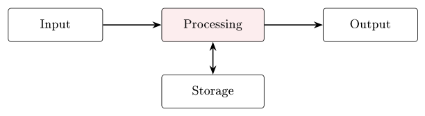
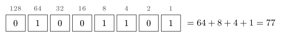
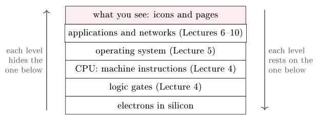

# Introduction: Everything is bits {#sec-01-introduction}

This course is about *how*, not *what*. You already know what a computer,
a file and the Internet are - you use them all day. Over twelve lectures
we look *inside*: How data is represented digitally, how the computer
executes a program, how an operating system shares the machine, and how
the Internet moves your bits around the world, layer by layer. This first
chapter does two jobs at once. It builds the shared vocabulary that every
later module leans on - data and information, hardware and software, bit,
byte and encoding, the Von Neumann machine - and it explains how the
course itself works: Lectures, Practice sessions, mandatory assignments
and the exam. One idea will keep returning until it feels obvious, and it
is worth stating on line one: *Inside the machine, everything is bits;
what differs between a number, a text and a photo is only the encoding.*

## What information technology is {#sec-01-what-it-is}

Information technology is not one thing but the interplay of five:
*Hardware*, the physical devices; *software*, the programs that run on
them; *data*, the information being processed; *networks*, how systems
communicate; and *people*, the users and professionals who design and run
it all. The course follows exactly that structure: Digital representation
of data first (Lectures 1–3), then the computer (Lectures 4–5), then the
Internet and its applications (Lectures 6–7), then the network itself,
layer by layer (Lectures 8–10), before two closing lectures of repetition
and exam preparation.

The first crucial distinction of the semester is between two words that
everyday language treats as synonyms.

::: {#def-data-info}
## Data and information
**Data** are raw symbols - meaningless on their own. **Information** is
data *plus a shared rule for reading it*: A context, a convention, an
encoding.
:::

::: {#exm-040102}
The string `040102` is data. Is it a date? If so, which one - the 4th of
January 2002, the 1st of April 2002, or the 2nd of January 2004,
depending on whether you read it as Norwegian, American or ISO order? Is
it a postal code, a price, a serial number? The symbols alone cannot say.
Only once sender and receiver *agree* on a rule - "this is a date,
day–month–year" - does the data carry meaning. Likewise the bit pattern
`01001000 01101001` is just sixteen bits; read under the ASCII convention
it becomes the greeting "Hi", and the reading `23.5` becomes information
only when you know it is a temperature in degrees Celsius. Keep this
example close: Most of what look like deep mysteries in this course -
file formats, protocols, character sets - are at bottom agreements of
exactly this kind.
:::

## Hardware, software, and the IPOS loop {#sec-01-ipos}

Every system in this course has two halves. *Hardware* is the physical:
Electronic and electro-mechanical parts - CPU, RAM, SSD, keyboard,
screen, cables. *Software* is the instructions: The programs that run on
that hardware - the operating system, the applications, your own code.
Neither works alone: Hardware without software is a non-functional lump;
software without hardware is text in a file.

Software itself splits into two layers. *System software* - the operating
system (Windows, macOS, Linux), device drivers, utilities - manages the
hardware and serves other programs. *Application software* - the browser,
the word processor, the game - is what you use directly, and it runs *on
top of* the system software: Applications do not control the hardware
directly; they request services from the operating system. That division
of labour gets a whole module of its own (Module 5).

What does every computer actually *do*? Strip away the variety and one
pattern remains, the IPOS model: **I**nput (keyboard, mouse, sensors)
flows into **P**rocessing (the CPU), which produces **O**utput (screen,
printer), with **S**torage (disk, memory) underneath the whole loop.
Every computer, from a phone to a server, follows this pattern; the Von
Neumann architecture of @sec-01-vonneumann is one concrete realisation of
it.

{#fig-ipos}

## Bits, bytes, words - and scale {#sec-01-bits-bytes}

All of it is measured in a small family of units.

::: {#def-bit}
## Bit, byte, word
A **bit** is one binary digit, either 0 or 1 - physically a low or high
voltage; the smallest unit of all. A **byte** is 8 bits, giving
$2^8 = 256$ distinct values - enough for one text character (for example
`01000001` is the letter A) - and the smallest *individually addressable*
unit of memory, hence the standard unit for memory and file sizes. A
**word** is the CPU's natural unit, 32 or 64 bits today; it determines,
among other things, how much memory the CPU can address. Modern PCs and
phones are 64-bit machines.
:::

From the byte upward, each named step is about a factor of one thousand,
and it pays to attach a mental anchor to each: A kilobyte
($\approx 10^{3}$ bytes) is a short email; a megabyte ($10^{6}$) a photo
or an MP3 song; a gigabyte ($10^{9}$) a high-quality movie; a terabyte
($10^{12}$) a laptop's whole disk; a petabyte ($10^{15}$) the scale of
CERN's particle-collision data. One honest footnote to this ladder: Two
conventions coexist - the decimal kilobyte (1 kB = 1000 bytes) and the
binary kibibyte (1 KiB = 1024 bytes). Disk vendors count in tens, memory
chips in twos; for this course, powers of ten suffice.

## Everything is bits: The idea of encoding {#sec-01-encoding}

Now the central idea of the whole course. Numbers, letters, sounds,
images and video are all stored and moved as sequences of 0s and 1s.
Across all media *the bits are the same*; what changes is the encoding.
The number 42 is `00101010`. The letter A is `01000001` under ASCII. The
colour red is `11111111 00000000 00000000` in 24-bit RGB - full red
channel, no green, no blue. A second of music is a stream of 16-bit
numbers, sampled 44 100 times per second.

How do bits count at all? Exactly the way decimal digits do, with two
symbols instead of ten: Three bits run `000`, `001`, `010`, `011`, `100`,
`101`, `110`, `111` - eight values, because $2^3 = 8$ - and every
additional bit *doubles* the range. That doubling is the quiet engine
behind everything from the 256 values of a byte to the address space of a
64-bit word. Module 2 works through binary conversions and arithmetic
properly; this is only the taste.

The hardware itself understands only a handful of *primitive types*:
Booleans (a single true/false bit), integers of 8, 16, 32 or 64 bits,
floating-point approximations of real numbers (standardised as IEEE 754),
characters (a code point in ASCII or Unicode), and addresses - pointers
to locations in memory. Everything richer - a JPEG image, a UTF-8 text, a
spreadsheet - is built from these primitives by following an agreed
standard. Which brings us to the definition the whole course hangs on.

::: {#def-encoding}
## Encoding
An **encoding** is the shared convention that assigns meaning to bit
patterns. A file format, a network protocol and a programming language
are each, at bottom, a standard for interpreting bits. Without the
encoding, the bits are noise.
:::

::: {#exm-byte3ways}
## One byte, three meanings
Take the single byte `01000001` and read it three ways. As an unsigned
integer it is $64 + 1 = 65$. As an ASCII character it is the letter `A` -
not by coincidence, since ASCII simply *assigns* the letter A to the
value 65. As the red channel of a 24-bit RGB pixel it is an intensity of
$65/255 \approx 25\,\%$ - a dark red contribution. Same bits, three
meanings; the meaning lives entirely in the convention you bring to the
reading. This is @exm-040102 again, one level down, and it is the single
most important idea in the course: Whenever a later module introduces a
mysterious-sounding artefact - a character set in Module 3, an IP header
in Module 9 - ask first, *what is the encoding here, and who agreed on
it?*
:::

::: {.callout-tip title="Worked exercise 1.1 - One byte, your turn"}
Read the byte `01001101` three ways: As an unsigned integer, as an ASCII
character, and as the red channel of an RGB pixel (roughly, in percent).
Work exactly as in @exm-byte3ways.

**Solution.** Write the weights over the bits and sum the columns holding
a 1:

{fig-align="center"}

As an integer: 77. As ASCII: Code 77 is the letter `M` (twelve places
after `A` = 65). As a red channel: $77/255 \approx 30\,\%$ intensity.
Same bits, three readings - the convention decides.
:::

## Inside the machine: Von Neumann {#sec-01-vonneumann}

Bits and encodings run on a physical machine, and nearly every machine
you will ever meet - laptop, phone, server, the controller in a washing
machine - follows one blueprint, proposed in 1945 and still standing.

::: {#def-vonneumann}
## The Von Neumann architecture
A Von Neumann computer consists of a **CPU** (the processor, which runs
instructions), **memory** (RAM: Fast and temporary, holding both data and
the program), and **input/output** devices (keyboard, screen, storage,
network), all connected by a **system bus**. Its defining feature is the
*stored-program principle*: Instructions and data share the same memory,
so a machine can be reprogrammed simply by loading different bits.
:::

Pause on the stored-program principle, because it is easy to read past. A
program *is data* - bits in memory like any other - which is why the same
physical machine can be a typewriter this minute and a chess opponent the
next. (It is also, incidentally, why the encodings of @def-encoding
matter so much: Even the instructions are bit patterns under a
convention, the CPU's instruction set.)

::: {#exm-fde}
## The heartbeat
At the centre of the machine, the CPU runs one simple cycle, repeated
without pause. **Fetch**: Read the next instruction from memory - a
dedicated register, the *program counter*, holds its address.
**Decode**: Determine what the instruction means. **Execute**: Perform it
- add, compare, jump, store. Then fetch again. At a clock speed of 3 GHz
a single core repeats this cycle about three billion times per second;
every program you have ever run, from a game to this PDF viewer, is
nothing but a very long sequence of such steps. When Module 4 opens the
CPU properly, this cycle is what we will find inside.
:::

Around the CPU, the Von Neumann roles are realised in the physical parts
of every PC: RAM as fast *volatile* working memory (its contents vanish
at power-off); SSD or HDD as *persistent* storage (slower, but it
survives power-off); the motherboard carrying the bus everything plugs
into; the GPU as a specialised processor for graphics and parallel
computation; and the I/O devices at the edges. Memory, in fact, forms a
*hierarchy*: Registers, then cache, then RAM, then SSD/HDD - each level
faster, smaller and costlier than the one below, with data moving up as
the CPU needs it. And because raw hardware would be unusable if every
program had to drive it directly, an *operating system* sits on top,
doing three things at once: Managing resources (allocating CPU time,
memory and storage), providing abstraction (programs see files and
windows, not disk sectors and pixels), and enforcing protection (keeping
programs and users from interfering with one another). Module 5 is
devoted to it. Finally, computers rarely work alone: They join networks -
one building's machines form a LAN, and the Internet is a network of
networks, with the web as its best-known service, moving pages over HTTP.
Modules 6–10 unfold how that connection actually works, layer by layer.

::: {.callout-note title="Excursus - The machine as a tower of levels"}
Andrew Tanenbaum opens his classic *Structured Computer Organization*
with an idea that quietly organises this entire course: A computer is
best understood as a *tower of levels*, each one a small "virtual
machine" built on top of the one below and hiding its details. At the
top, you click an icon; below that, an application runs; below that, the
operating system manages resources; below that, the CPU executes machine
instructions; below that, logic gates switch; and at the very bottom,
electrons move through silicon. Nobody - not even a professional - thinks
about all the levels at once; the whole trick of computing is that *each
level only needs to trust the one directly beneath it*. Keep the tower in
mind as a map: Lectures 1–3 live near the bottom (bits and their
encodings), Lecture 4 climbs from gates to the CPU, Lecture 5 adds the
operating system, and Lectures 6–10 build the network levels on top.
Whenever a chapter feels abstract, ask which floor of the tower you are
standing on.

*(Tanenbaum & Austin, Structured Computer Organization, 6th ed., 2013)*
:::

{#fig-levels}

## Eighty years in six milestones {#sec-01-milestones}

How did we get here? Six dates sketch the arc. **1945**: ENIAC, the first
general-purpose electronic computer - thirty tons, 18 000 vacuum tubes.
**1971**: The microprocessor - Intel's 4004 puts an entire CPU on a
single chip. **1981**: The IBM PC brings personal computing to businesses
and homes. **1991**: Tim Berners-Lee at CERN launches the World Wide Web.
**2007**: The iPhone takes the smartphone mainstream. **2022**: ChatGPT
puts generative AI in the hands of the public.

::: {.callout-note title="Excursus - Before the milestones"}
The arc has a prehistory worth a sentence. Charles Babbage designed a
fully programmable *mechanical* computer - the Analytical Engine - in the
1830s, a century before the technology existed to build it, and Ada
Lovelace wrote programs for it that could never run. And the first
working program-controlled computer was not ENIAC but Konrad Zuse's
relay-based Z3, completed in Berlin in 1941 - largely unknown outside
Germany for decades. History books call 1945 the starting line mostly
because ENIAC was electronic, general-purpose *and* publicly known; the
ideas are older than the hardware.

*(Tanenbaum & Austin, 2013, ch. 1)*
:::

The engine behind that arc has a name: *Moore's Law*, Gordon Moore's 1965
observation that the number of transistors on a chip doubles roughly
every two years. Plotted on a logarithmic scale the growth is a straight
line - the signature of an exponential - running from the 4004's 2 300
transistors to modern chips carrying tens of billions (Apple's M-series
processors are the everyday example). Two honest caveats close the story.
First, the law is finally slowing: Transistors approach atomic scales and
heat limits bite, so the gains now come from more cores, from GPUs and AI
accelerators, and from chiplet designs rather than from ever-smaller
transistors alone. Second, any projection forward - the lecture chart
dashes one for 2030 - is an assumption, and should be labelled as such.
Either way, that exponential hardware growth is exactly what now makes
everyday AI possible - which is why the chapter ends where it does.

## AI in your studies {#sec-01-ai}

Generative AI - ChatGPT, Claude, Gemini and their siblings - is already
part of how you work, and pretending otherwise would be silly. It
explains, summarises, codes and drafts quickly and fluently. It also,
with the same fluency, confidently invents facts, skips the reasoning,
and - used carelessly - deprives you of exactly the practice this course
exists to give you. The skill you need is not *whether* to use it but
*when and how*.

The rule of thumb for this course: *Use AI as a tutor that questions you,
not a writer that replaces you.* Four practices make the rule concrete.
Explain it back: After the AI explains something, close the tab and
re-explain it in your own words - if you cannot, you have not learned it
yet. Ask for problems, not answers: "give me three practice questions on
binary conversion" beats "convert this for me". Verify sources: AI
invents references; check them before citing anything. And reflect on the
exchange: What did you actually learn?

On academic integrity the line is drawn where you would expect. Generally
acceptable: Using AI to clarify a concept, practising with AI-generated
exercises, getting feedback on a draft *you* wrote. Not acceptable:
Submitting AI text as your own work, letting AI write your assignment,
entering exam questions into a chatbot. When in doubt, ask - and
Kristiania's full policy is published on `kristiania.no`.

## How the course works {#sec-01-course}

Twelve lectures, each paired later in the same week with a two-hour
guided *Practice* session - bring your laptop; the exercise sets and
their solutions live in Canvas. Across the semester there are three
mandatory individual assignments (*arbeidskrav*), graded pass/fail; all
three must be approved before you may sit the exam. The final exam is
on-site, multiple choice, graded pass/fail (*bestått / ikke bestått*) -
and *all* course material is examinable. The course is 7.5 ECTS, which
honestly means about 200 hours of student work across the semester; the
lectures and Practice sessions are the visible tip of that budget.

Everything lives in Canvas: Announcements (preparation notes before each
lecture - check before class), messages and discussions, materials
(slides, scripts, worksheets, solutions), assignment submission, and
grades. Expectations run in both directions. From you: Attend and engage,
do the reading before class, submit on time, ask when something is
unclear. From me: Clear, well-prepared lectures, materials posted in good
time, replies within 48 hours, and office hours every week.

About that reading. The lectures are the curriculum, so the reading load
is deliberately light: 15–30 minutes per lecture, listed precisely in
`Readings.xlsx` on Canvas, drawn from the recommended textbook - Fox,
*Information Technology*, 2nd edition (CRC Press, 2021). Light is not the
same as optional: Skipping the chapter is cheaper *this* week and more
expensive every week after, because each lecture builds on terms the
reading introduced; readers cross the break-even point after a few weeks,
and arrive at the exam having read the curriculum once already. (You will
meet this argument - monster included - as a slide at the start of every
lecture. Do not grow the monster.) For optional extra depth, Kabelová and
Dostálek's *Understanding TCP/IP* serves the network modules, and the
free Cisco Networking Academy is a good companion for Modules 8–10.

**Before Lecture 2 (Number systems).** Get the textbook. Read its chapter
on number systems - `Readings.xlsx` gives the exact pages. Try, on paper,
to write the numbers 0 through 15 in binary. And think about one
question: Why do computers use binary rather than decimal?

## Summary {#sec-01-summary}

Information technology is hardware, software, data, networks and people;
this course walks that list over twelve lectures. Information is data
plus a shared rule for reading it (@def-data-info), and inside the
machine that rule is an *encoding* (@def-encoding): The same byte is 65,
the letter A, or a quarter-strength red, depending on the convention
(@exm-byte3ways) - everything is bits, and only the encoding differs.
Those bits live in a Von Neumann machine (@def-vonneumann): CPU, memory
and I/O on a common bus, with programs stored as data and executed by the
fetch–decode–execute heartbeat billions of times per second (@exm-fde).
Eighty years of Moore's Law carried us from ENIAC's vacuum tubes to chips
with tens of billions of transistors - and to AI, which you should use as
a tutor, not a ghost-writer. Next week we teach those bits to count.

## Interactive checks {#sec-01-interactive .unnumbered}

A round of quick interactive drills - instant feedback, all in your browser, nothing recorded. Every task has a show-solution button; clicking it straight away is no fun.













## Self-check {#sec-01-self-check .unnumbered}

Try these before the Practice session; sketch answers follow below.

::: {#exr-01-data-info}
## Data versus information
Why is `040102` data rather than information - and what, precisely, would
turn it into information?
:::

::: {#exr-01-byte3ways}
## One byte, three readings
Interpret the byte `01000010` in three ways: As an unsigned integer, as
an ASCII character, and as an RGB red channel (roughly, in percent).
:::

::: {#exr-01-256}
## Why a byte has 256 values
Why does a byte have exactly 256 possible values, and what does each
additional bit do to the range of a binary number?
:::

::: {#exr-01-stored-program}
## The stored-program principle
State the stored-program principle in one sentence, and explain why it
means a computer can be "reprogrammed by loading different bits".
:::

::: {#exr-01-fde}
## The fetch–decode–execute cycle
Name the three steps of the CPU's basic cycle in order, and say which
register keeps the cycle on track and how.
:::

::: {.callout-note collapse="true"}
## Sketch answers
(1) The symbols carry no meaning by themselves - date, postal code and
serial number are all possible readings; a shared convention ("a date,
day–month–year") turns it into information (@def-data-info). (2) As an
integer: $64+2 = 66$; as ASCII: The letter B (one code point after
A = 65); as a red channel: $66/255 \approx 26\,\%$ intensity. (3) A byte
is 8 bits and each bit has two states, so $2^8 = 256$ values; every
additional bit doubles the range. (4) Instructions and data share the
same memory; since the program is itself just bits in memory, loading
different bits gives the same hardware a different behaviour. (5) Fetch,
decode, execute; the *program counter* holds the address of the next
instruction, so the CPU always knows where to fetch from - and jumps work
by changing it.
:::

::: {.bridge}
What we now share is a vocabulary: Everything in the machine is bits;
meaning is added by encodings; and the machine that holds them follows
Von Neumann's blueprint, executing stored instructions billions of times
per second. What we cannot yet do is *work* with those bits. Chapter 2
builds directly on the doubling rule met here: How binary numbers are
read, written, converted and computed with - including, by one elegant
trick, the negative ones.
:::
