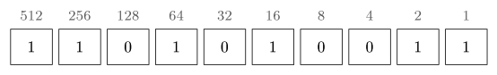
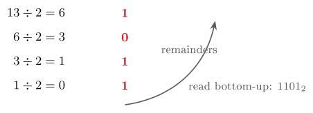

# Binary, hex and two's complement {#sec-02-binary}

Chapter 1 left us with three results: Everything is bits, the machine
that processes them follows the Von Neumann pattern, and an encoding is
the convention that gives bits meaning. This chapter examines the most
fundamental encoding of all: How *numbers themselves* are represented. We
answer why hardware insists on exactly two digits, learn to convert
between decimal, binary and hexadecimal in both directions, and finish
with the one trick most students ask about — two's complement, which lets
a CPU subtract using nothing but an adder. Fair warning and encouragement
in one: This material constitutes the bulk of the first mandatory
assignment (Innsendingsoppgave 1), so the time you invest here pays off
twice.

## Why binary? {#sec-02-why-binary}

Binary is not an aesthetic choice; it is a physical necessity. An
electronic component can tell *two* voltage states apart reliably — LOW
around 0 V read as 0, HIGH around 5 V read as 1, with a wide safety gap
between them. Try to squeeze *ten* states into the same voltage range and
each digit gets a narrow band; a little noise, heat or manufacturing
variation pushes a value across a boundary and silently corrupts the
digit. Two states survive the real world; more do not.

The device that supplies those two states is the transistor: An
electronic switch controlled by a voltage, with no moving parts. A
sufficient signal on its control input (the base or gate) lets current
flow — interpreted as 1; below the threshold no current flows —
interpreted as 0. A modern chip contains tens of billions of these
switches, each switching billions of times per second; coordinating them
is, at bottom, all that computation is. (How switches are wired into
logic and arithmetic is Chapter 4's subject.)

One switch gives two values; what does a *row* of them give? With $N$
bits one can represent $2^N$ distinct values, and every additional bit
*doubles* the count — the doubling you met in Chapter 1, now with anchors
worth memorising: 4 bits give 16 values (one hexadecimal digit, as we
shall see); 8 bits give 256 (one byte — one character); 16 bits give
65 536; 32 bits about 4.3 billion (the size of the IPv4 address space,
Module 9); 64 bits about $1.8\times10^{19}$ — the word size of a modern
CPU (@def-bit).

::: {#exm-threebulbs}
## Three switches, eight values
Counting in binary obeys the same rule as counting in decimal; there are
simply only two digit symbols, so columns fill up sooner. In decimal you
count 0, 1, …, 9 — and then, out of symbols, you write 10: Reset the
column and carry one. In binary you count 0, 1 — and are out of symbols
already, so the next number is 10. Three bits therefore run 000, 001,
010, 011, 100, 101, 110, 111: Eight patterns, $2^3 = 8$, counting 0
through 7. Same rule, fewer symbols.
:::

## Positional number systems {#sec-02-positional}

To read binary fluently, first notice what our own decimal system
actually does. In the number 5372, each position carries a *weight* that
is a power of the base, and the digit says how many of that weight to
count:
$$
  5372 = 5\cdot10^{3} + 3\cdot10^{2} + 7\cdot10^{1} + 2\cdot10^{0}.
$$

::: {#def-positional}
## Positional notation
In a positional number system with base $b$, a numeral
$d_n d_{n-1}\cdots d_1 d_0$ (with digits $0 \le d_i \le b-1$) denotes the
value
$$
  d_n\cdot b^{\,n} + d_{n-1}\cdot b^{\,n-1} + \cdots + d_1\cdot b^{1}
  + d_0\cdot b^{0}.
$$
:::

The rule is the same for every base; only the alphabet changes. Base 2
(binary) uses the digits 0 and 1 and is imposed on us by the hardware.
Base 10 (decimal) uses 0–9 and is imposed on us by habit. Base 16
(hexadecimal) uses 0–9 and A–F and exists, as @sec-02-hex shows, purely
as a compact notation for bits.

Because the same characters denote different numbers in different bases,
we must mark the base. The string 101 is $101_2 = 5$ read as binary,
$101_{10} = 101$ read as decimal, and $101_{16} = 257$ read as hex. This
script uses subscripts; in source code you will meet the prefixes `0b101`
(binary), `0x65` (hex) and `0o12` (octal) doing the same job. Notice, by
the way, that this is @def-encoding again in miniature: The symbols are
the data, the base is the convention.

## Binary numbers: Converting in both directions {#sec-02-converting}

Every binary conversion rests on the powers of two, so it is worth
memorising the first eleven outright: 1, 2, 4, 8, 16, 32, 64, 128, 256,
512, 1024. Two of them carry extra meaning: $2^{10} = 1024 \approx 10^3$,
which is why a kilobyte is approximately one thousand bytes; and
$2^{16} = 65\,536$, the range of a 16-bit value.

*Binary to decimal* is a reading exercise: For every position holding a
1, add that position's power of two.

::: {#exm-bin2dec}
Convert $1101010011_2$ to decimal. Write the weights over the bits — 512,
256, 128, 64, 32, 16, 8, 4, 2, 1 — and collect the ones:
$$
  512 + 256 + 64 + 16 + 2 + 1 = 851_{10}.
$$
:::

{#fig-weights}

*Decimal to binary* runs the other way, and two methods reach the same
answer. The **subtraction method** is the intuitive one: Subtract the
largest power of two that fits, write a 1 in its column, and repeat with
the remainder; powers that do not fit get a 0.

::: {#exm-dec2bin}
## Continuation of @exm-bin2dec
Convert 851 back. Does 512 fit? Yes — write 1, keep 339. Does 256 fit?
Yes — 1, keep 83. 128? No — 0. 64? Yes — 1, keep 19. 32? No — 0. 16? Yes
— 1, keep 3. 8? No. 4? No. 2? Yes — 1, keep 1. 1? Yes — 1, done. Reading
the bits from the highest power down: $851_{10} = 1101010011_2$, exactly
the string we started from.
:::

The **division method** is the mechanical alternative — and the one a
computer itself uses: Divide by two repeatedly, record each remainder,
and read the remainders from the bottom up. For 13: $13\div2 = 6$
remainder **1**; $6\div2 = 3$ r **0**; $3\div2 = 1$ r **1**;
$1\div2 = 0$ r **1**. Bottom-up: $1101_2 = 13_{10}$. Use whichever you
like; check yourself with the other.

{#fig-division}

Three quick ones to try before reading on (they were the in-class pause,
and they are the level of Assignment 1): $1011_2$ to decimal; $25_{10}$
to binary; $10101_2$ to decimal. Answers: 11; $11001_2$; 21.

::: {.callout-tip title="Worked exercise 2.1 — Both directions, both methods"}
Convert $89_{10}$ to binary twice — once by the subtraction method, once
by the division method — and check that the two answers agree. Then read
$0110\,1110_2$ back into decimal.

**Solution.** Subtraction: 64 fits (keep 25), 32 no, 16 fits (keep 9), 8
fits (keep 1), 4 no, 2 no, 1 fits $\Rightarrow 101\,1001_2$. Division:
$89{:}2 = 44$ r 1, $44{:}2 = 22$ r 0, $22{:}2 = 11$ r 0, $11{:}2 = 5$
r 1, $5{:}2 = 2$ r 1, $2{:}2 = 1$ r 0, $1{:}2 = 0$ r 1; bottom-up
$101\,1001_2$ — the same. Back-reading: $64+32+8+4+2 = 110_{10}$.
:::

## Hexadecimal and octal {#sec-02-hex}

Long bit strings are hard for human eyes to parse. Decide at a glance
whether
$$
  1010\,0100\,1001\,1011_2 \quad\text{and}\quad
  1010\,0100\,1000\,1011_2
$$
denote the same value — most readers cannot, and the single differing bit
hides in plain sight. Decimal compresses the value (42 139) but obscures
the bits entirely. Hexadecimal gives the best of both: As compact as
decimal, yet each digit maps *cleanly* onto exactly four bits, because
$16 = 2^4$. The value above is $\mathrm{A49B}_{16}$ — four characters,
and each one expandable back into its four bits (a *nibble*) without any
arithmetic. Base 16 borrows 0–9 from decimal and adds A–F for the values
10–15; the digit-to-nibble table (A = 1010, B = 1011, …, F = 1111) is
small enough to learn and worth it.

Converting between binary and hex is therefore mere *grouping*: Split the
bits into fours from the right, replace each group by its digit —
$1010\;0011\;1001\;1111_2 = \texttt{0xA39F}$ — and expand digit-by-digit
for the reverse. No powers, no division.

Hex is not an academic exercise; it appears wherever raw bytes need a
readable form, and you will meet all four of these again in this course.
Colours: `#D81E2E` is $(R,G,B) = (216,30,46)$ — the Kristiania red, three
bytes written as three hex pairs. Memory: Addresses are written in hex,
e.g. `0x7FFE0040`. Networks: A MAC address is six hex bytes, e.g.
`3C:5A:B4:1F:9E:02` (Module 10). Encodings: A Unicode code point such as
U+1F600 (Chapter 3). The reading rule throughout: One hex digit is four
bits; one *pair* of hex digits is one byte.

Octal, base 8, plays the same game with groups of *three* bits, since
$8 = 2^3$: $110\;010\;100\;011_2 = 6243_8$. It is largely historical but
persists in one place every Linux user meets — Unix file permissions,
`chmod 755`. And should you ever need hex ↔ octal: They do not convert
directly; binary is the common ground, so expand the hex digits to bits,
regroup in threes, and read off
($\mathrm{BB3}_{16} = 1011\,1011\,0011_2 = 101\,110\,110\,011_2 =
5663_8$).

## Binary arithmetic and two's complement {#sec-02-arithmetic}

*Addition* first, because everything else reduces to it. Binary addition
is decimal addition with only four cases per column: $0+0=0$; $0+1=1$;
$1+0=1$; and $1+1=0$ *carry* 1. Add column by column from the right,
propagating carries exactly as in decimal: $0011 + 0010 = 0101$, that is,
$3+2=5$.

Alongside arithmetic, bits support *logical* operations applied to each
position independently, with no carry between columns: AND is 1 only if
both inputs are (it *masks* bits); OR is 1 if either is (it *sets* bits);
XOR is 1 if exactly one is (it *toggles* bits); NOT inverts a single
input. So $1100\;\mathrm{AND}\;1010 = 1000$,
$1100\;\mathrm{OR}\;1010 = 1110$, $1100\;\mathrm{XOR}\;1010 = 0110$.
These four are the building blocks of low-level programming — and, as
Chapter 4 shows, of the hardware itself. A close relative is *shifting*:
Sliding every bit one place left multiplies the value by two
($0000\,0011 \to 0000\,0110$, i.e. $3 \to 6$), one place right divides by
two. Shifting is far cheaper than multiplication, which is why compilers
replace $\times2, \times4, \times8$ with shifts whenever they can.

Now the real question: So far every number has been positive — how does a
fixed row of bits store $-19$? Three schemes were proposed.
*Sign-and-magnitude* spends the leftmost bit on the sign ($+5 = 0101$,
$-5 = 1101$): Intuitive, but it has two zeros and awkward arithmetic.
*Ones' complement* negates by inverting every bit ($-5 = 1010$): Still
two zeros. Modern hardware settled on the third.

::: {#def-twoscomp}
## Two's complement
In two's complement, the negative of a value is obtained by inverting
every bit and then adding 1. The scheme has a single zero and is the
standard signed representation in essentially all modern hardware.
:::

::: {#exm-minus19}
## $-19$ in 8 bits
Start with $+19 = 0001\,0011$. Invert every bit: $1110\,1100$. Add 1:
$1110\,1101$ — that is $-19$. Verify by adding it to $+19$:
$0001\,0011 + 1110\,1101 = 1\,0000\,0000$; discard the carry-out beyond
the eighth bit and the result is $0000\,0000 = 0$, exactly as $19 +
(-19)$ should be.
:::

Why this scheme won is visible in the verification: With two's
complement, *subtraction is just another addition*. To compute $A - B$,
the CPU computes $A + (-B)$ — so a single adder circuit performs both
operations, a significant engineering advantage.

::: {#exm-sub}
## Subtraction as addition
$50 - 19$: The CPU forms $-19 = 1110\,1101$ as above and adds:
$0011\,0010\,(50) + 1110\,1101\,(-19) = 1\,0001\,1111$; discard the
carry-out and read $0001\,1111 = 31$. What we write as a subtraction, the
machine performs as an addition. Try $12 - 7$ yourself the same way:
$+7 = 0000\,0111$; invert, $1111\,1000$; add 1, $1111\,1001 = -7$; add to
$0000\,1100\,(12)$ to get $1\,0000\,0101$; discard the carry:
$0000\,0101 = 5$.
:::

::: {.callout-tip title="Worked exercise 2.2 — Negative numbers"}
Write $-42$ in 8-bit two's complement, and verify your answer by adding
it to $+42$.

**Solution.** $+42 = 0010\,1010$. Invert: $1101\,0101$. Add 1:
$1101\,0110 = -42$. Check: $0010\,1010 + 1101\,0110 = 1\,0000\,0000$;
discard the ninth bit and the result is $0000\,0000 = 0$, as $42 + (-42)$
must be.
:::

A fixed bit width also fixes the *range*. Unsigned, $N$ bits run from 0
to $2^N - 1$; signed two's complement runs from $-2^{N-1}$ to
$2^{N-1} - 1$. For 8 bits that is 0–255 unsigned and $-128$ to $+127$
signed; for 32 bits roughly $\pm2.1$ billion signed. The signed range is
slightly asymmetric because zero occupies one slot, grouped with the
positives. Exceed the range and the value *wraps around silently*:
Unsigned $1111\,1111\,(255) + 1$ becomes $0000\,0000\,(0)$; signed
$0111\,1111\,(+127) + 1$ becomes $1000\,0000$ — which two's complement
reads as $-128$. The hardware does not warn you. Overflow bugs of exactly
this kind are a recurring, and occasionally dangerous, source of software
failures.

## Assignment 1, and what comes next {#sec-02-assignment}

Today's material constitutes the bulk of Innsendingsoppgave 1: Decimal ↔
binary conversion, binary addition with carries, subtraction via two's
complement, number-system characteristics, and the design of a
base-16-like system of your own. Practical guidance from the lecture,
worth repeating verbatim: Show your working — the reasoning is graded,
not only the answer; verify yourself with a calculator's "programmer"
mode; work through the Practice exercises first; and begin early — the
assignment is individual, all three arbeidskrav must be approved to sit
the exam, and resubmission is possible only if you submit early enough to
use it.

**Before Lecture 3 (Text & multimedia).** Read the Module 3 chapter in
the textbook — `Readings.xlsx` gives the pages. Watch the short video on
ASCII and Unicode in Canvas (~10 minutes). Try a small experiment: Save a
`.txt` file containing *å ø æ* and an emoji, and compare the file size
with a plain-English file. And think about why the same word occupies
different numbers of bytes under different encodings — Chapter 3 answers
it.

## Summary {#sec-02-summary}

Hardware imposes binary: Two voltage states are reliable, ten are not,
and every bit is a transistor, on or off. Positional notation
(@def-positional) applies to any base — the same rule, a different
alphabet — and conversions follow from it: Binary to decimal by summing
the weights of the ones (@exm-bin2dec), decimal to binary by subtracting
powers of two or by repeated division. Hexadecimal is binary in four-bit
groups — $\mathrm{A39F}$ *is* $1010\,0011\,1001\,1111$ — and octal the
same in threes. And two's complement (@def-twoscomp) — invert and add 1 —
gives negative numbers with a single zero and reduces subtraction to
addition, so the CPU needs only an adder; the price of a fixed width is a
fixed range, and silent overflow at its edges.

## Self-check {#sec-02-self-check .unnumbered}

::: {#exr-02-bin2dec}
## Binary to decimal
Convert $1011\,0110_2$ to decimal, showing the weights you summed.
:::

::: {#exr-02-dec2bin}
## Decimal to binary, two methods
Convert $173_{10}$ to binary twice: Once by the subtraction method, once
by the division method.
:::

::: {#exr-02-hex}
## Hexadecimal to bits and back
Expand $\mathrm{F3}_{16}$ into bits, and give its decimal value.
:::

::: {#exr-02-twoscomp}
## Subtraction in two's complement
Compute $9 - 12$ in 8-bit two's complement, and interpret the resulting
bit pattern.
:::

::: {#exr-02-overflow}
## Unsigned overflow
In unsigned 8-bit arithmetic, what is $250 + 10$ — and why is the answer
dangerous rather than merely wrong?
:::

::: {.callout-note collapse="true"}
## Sketch answers
(1) $128+32+16+4+2 = 182$. (2) $173 = 128+32+8+4+1 \Rightarrow
1010\,1101_2$; division remainders bottom-up give the same.
(3) $\mathrm{F} = 1111$, $3 = 0011$, so $1111\,0011_2 = 243$.
(4) $-12 =$ invert $0000\,1100$ and add 1 $= 1111\,0100$; then
$0000\,1001 + 1111\,0100 = 1111\,1101$ with no carry-out — a negative
pattern; invert and add 1 to read its magnitude: $0000\,0011 = 3$, so the
result is $-3$. (5) $250+10 = 260 > 255$; the value wraps to
$260-256 = 4$ — silently, with no error signalled, which is why overflow
bugs go unnoticed until they do damage.
:::

::: {.bridge}
We can now count, convert and calculate in binary, and we know why the
hardware insists on two digits — numbers are settled. Building on exactly
this, Chapter 3 applies the encoding idea of Chapter 1 to everything that
is *not* a number: Text through ASCII and Unicode, images, sound and
video. The bits stay the same; only the conventions grow richer.
:::
