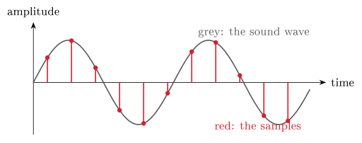

# Text and multimedia {#sec-03-text-multimedia}

Chapter 2 showed that numbers are bits. This chapter shows that so is
everything else. Text, images, sound and video each get their own
treatment, but one idea recurs so often that you should watch for it
deliberately: *A standard tells you how to read the bits* — as letters,
pixels, sound samples or frames. That is @def-encoding put to work four
times over, and by the end of the chapter the phrase "an H.264 video with
AAC audio in an MP4 container" will parse itself.

## Text: From ASCII to code pages {#sec-03-ascii}

To a computer, the letter A is just a number; the only question is
*which* number. Spell out "Hello": The characters become the numbers 72,
101, 108, 108, 111; each number becomes eight bits; each eight bits is
one byte. The encoding is the agreement on which number means which
letter — get it wrong, and "Hello" becomes gibberish.

The first widely shared answer was ASCII, the American Standard Code for
Information Interchange of 1963: A 7-bit code, hence $2^7 = 128$ values —
one each for the English letters, the digits, punctuation, and a set of
non-printing *control codes* (codes 0–31 and 127: NUL = 0, TAB = 9,
LF = 10, ESC = 27, DEL = 127). The printable range is 32–126, and a few
landmarks are worth knowing by heart: Space = 32, `'0'` = 48, `'A'` = 65
(hex `0x41` — the byte of @exm-byte3ways), `'a'` = 97. Two patterns hide
in those numbers. First, `'a'` = `'A'` + 32: Upper and lower case differ
by a single bit. Second, the digits start at 48, so `'5'` − `'0'` = 5 — a
classic programming trick for turning a digit character into its value.
The full table is usually printed as 16 columns: The code is row × 16
plus column, in hex, so row `4x`, column 1 is `0x41` = A.

ASCII's limit is in its name: It only speaks American. 128 values leave
no room for å, ø, æ — let alone German umlauts, French accents, Cyrillic,
Chinese or emoji; a universal repertoire needs well over 100 000
characters. The first workaround stretched ASCII from 7 to 8 bits,
gaining 128 extra slots per *code page*: ISO 8859-1 ("Latin-1") fills
128–255 with Western-European letters; Windows-1252 is Microsoft's
variant with different glyphs at 128–159. But a code page only redefines
the upper half, so no single page covers Norwegian *and* Russian *and*
Greek at once — and the same byte shows a *different character* under a
different page. That failure mode has a name you have seen on screen:
*Mojibake*, the garbage that appears when a file crosses between pages.
The fix had to be one universal table.

## Unicode and its planes {#sec-03-unicode}

::: {#def-unicode}
## Unicode
Unicode (1991) is a single catalogue of every writing system: Each
character receives a unique **code point**, written U+ followed by a hex
number. Crucially, Unicode fixes only the character's *identity*; *how
the code point is stored as bytes* is left to a separate encoding. One
catalogue, several encodings.
:::

Examples across the range: A is U+0041 (the ASCII region — by design, the
first 128 code points are identical to ASCII); the Norwegian Å is U+00C5;
the Cyrillic Ya is U+042F; a common Chinese character sits at U+4EAC; the
smiling-face emoji is U+1F600. The catalogue's capacity is about
1.1 million code points, of which roughly 150 000 are assigned today,
organised into seventeen *planes* of 65 536 code points each. Plane 0,
the Basic Multilingual Plane (U+0000–U+FFFF), holds ASCII, the European
scripts, most CJK — almost all everyday text. Plane 1, the Supplementary
Multilingual Plane, holds historic scripts, mathematical symbols and the
emoji. Plane 2 carries rare CJK ideographs; planes 3–13 are essentially
unassigned room to grow; plane 14 holds special-purpose tag characters;
planes 15–16 are private-use space for company logos and custom symbols.
In practice, planes 0 and 1 hold almost all real text — which will matter
in a moment, because "fits in 16 bits or not" is exactly where the
encodings differ.

## UTF-8: Code points into bytes {#sec-03-utf8}

A code point is just a number; an *encoding* turns it into bytes, and
three are in serious use. UTF-32 spends a fixed four bytes on every
character: Direct indexing, but wasteful — four times the space for plain
ASCII. UTF-16 spends two bytes on BMP characters and four beyond: Compact
for CJK, used internally by Windows, Java and .NET, but not
ASCII-compatible, and byte order matters. UTF-8 is the variable-length
design that won the web: One to four bytes per character,
ASCII-compatible, compact for Western text — the universal default of the
modern web, most APIs, and Linux and macOS alike. Use it unless you have
a strong reason not to.

UTF-8's mechanism is elegant enough to learn exactly. The leading bits of
the *first* byte announce the total length: A leading 0 means one byte
(pattern `0xxxxxxx` — plain ASCII, unchanged); `110xxxxx` opens a
two-byte character; `1110xxxx` a three-byte one; `11110xxx` a four-byte
one. Every continuation byte begins `10xxxxxx`. To decode, read the first
byte's prefix, collect the announced number of bytes, strip the marker
bits, and join the remaining `x` bits: That is the code point.

::: {#exm-utf8}
## Encoding Å by hand
The code point is U+00C5, i.e. $\texttt{0xC5} = 1100\,0101_2$. That needs
more than 7 bits, so choose the two-byte pattern `110xxxxx 10xxxxxx`,
which has room for eleven data bits. Write the code point in eleven bits
— `000 1100 0101` — and fill them in: `110`00011 `10`000101, that is
$1100\,0011\;1000\,0101 = \texttt{0xC3 0x85}$. So Å is stored as the two
bytes `C3 85` — while a plain A remains the single byte `41`. This, in
one example, is why the file you saved after Lecture 2 grew when you
typed *å ø æ*: The same "length" in characters is not the same length in
bytes, and an emoji (plane 1) costs four.
:::

{#fig-utf8}

::: {.callout-tip title="Worked exercise 3.1 — Encode a character by hand"}
Encode the Norwegian æ — code point U+00E6 — in UTF-8, following
@exm-utf8: Pick the byte pattern first, then fill in the data bits.

**Solution.** $\texttt{0xE6} = 1110\,0110_2$ needs more than 7 bits
$\Rightarrow$ two-byte pattern `110xxxxx 10xxxxxx` with eleven data bits.
Write the code point in eleven bits — `000 1110 0110` — and fill in:
`110`00011 `10`100110 $= 1100\,0011\;1010\,0110 = \texttt{0xC3 0xA6}$. So
æ is the two bytes `C3 A6`.
:::

## Text files, binary files, and magic numbers {#sec-03-magic}

Every file is bytes; the question is only whether to read them as
characters. A *text file* is one whose bytes are meant to be read as
characters (UTF-8 by default): It opens cleanly in any editor and is easy
to diff and version-control — `.txt`, `.py`, `.html`, `.csv`, `.json` and
friends. A *binary file* carries bytes in some tool-specific format where
any value 0–255 is valid: It looks like garbage in an editor and needs
the right program — `.png`, `.jpg`, `.mp3`, `.pdf`, `.zip`, `.exe`,
`.docx`. Strictly speaking, a text file is just a binary file whose every
byte happens to be a valid character; the operating system does not
distinguish — *you* do.

How, then, does software tell formats apart? Often by the first few
bytes, the *magic number*, which identifies the format regardless of the
file extension. PNG files begin `89 50 4E 47 0D 0A 1A 0A` (containing the
letters "PNG" plus binary markers); JPEG begins `FF D8 FF`; GIF spells
out "GIF89a"; PDF begins with the characters `%PDF-`; ZIP begins `50 4B`
— "PK", for Phil Katz, ZIP's author; Linux executables begin
`7F 45 4C 46` ("ELF"); and Java bytecode begins, famously, `CA FE BA BE`.
Rename a PDF to `photo.jpg` and the magic number still says PDF: The
extension is convention; the magic number is reality.

## Images: Pixels or instructions {#sec-03-images}

A digital *raster* image is a two-dimensional grid of colour values; each
cell is one pixel, stored as three bytes — red, green, blue, each 0–255 —
or four with an alpha (transparency) channel. The image is just that list
of colour values, read left to right, top to bottom. Do the arithmetic
once and remember the order of magnitude: A 4K image, $3840\times2160$
pixels at 3 bytes each, is about 24 MB uncompressed.

The alternative stores not the result but the *recipe*: A *vector* image
is a list of drawing instructions — "circle, centre $(4,4)$, radius 3.2,
fill red" — and therefore scales to any size without blockiness. Rule of
thumb: Photographs are raster (too much irregular detail for any formula)
in JPEG, PNG or WebP; logos, icons and type are vector (SVG, PDF), so
they stay sharp at every size.

Colour itself comes in two opposite systems. On screen, colour is
*additive*: Pixels emit light, and mixing red, green and blue makes any
colour — all three at maximum is white, all zero is black, $(255,0,0)$ is
pure red; the web's standard colour space is sRGB. On paper, colour is
*subtractive*: Ink absorbs light, white comes from the paper itself, and
the printing inks are cyan, magenta, yellow and black — CMYK, where K
stands for the *key plate* (and conveniently avoids clashing with B for
blue); C+M+Y alone mix to a muddy brown, so black gets its own, cheaper
ink. More ink means darker, more light means brighter — which is why a
design vibrant on screen can print duller, and designers calibrate.

Finally, formats. JPEG: Raster, lossy — superb for photographs, poor for
logos and text, where its artefacts show. PNG: Raster, lossless — the
choice for logos, screenshots and anything needing transparency, at the
price of larger photo files. GIF: Lossless but limited to 256 colours;
survives for simple animation. WebP: The modern web format, lossy or
lossless. SVG: Vector — icons, logos, diagrams; useless for photographs.

## Compression {#sec-03-compression}

The sizes above explain why compression exists. Storage is cheap, but
bandwidth and time are not: Smaller files mean faster downloads and less
mobile data, and streaming simply would not exist without it — a
90-minute HD (720p) film is roughly 500 GB uncompressed and about 4 GB in
H.264, a factor of 125.

::: {#def-compression}
## Lossless and lossy compression
**Lossless** compression produces a file from which the original can be
reconstructed bit for bit; typical savings are 30–70 %. Use it for
anything you cannot recreate: Text, code, logos (PNG), audio archives
(FLAC). **Lossy** compression discards detail that humans do not notice
and is never bit-identical to the original; typical savings are 90–99 %.
Use it for anything you could re-shoot or re-record: Photos (JPEG), music
(MP3/AAC), video (H.264).
:::

Lossless methods all exploit patterns and redundancy, and three tricks
cover the field. *Run-length encoding* replaces runs with "how many of
what": `AAAAAABBBCDD` becomes `6A 3B 1C 2D`. *Huffman* (frequency) coding
gives frequent symbols short codes, exactly as Morse did by hand: E is a
single dot, the rare Q a long sequence. *Differential coding* stores the
change rather than the value: The readings 100, 102, 105, 103 become 100,
$+2$, $+3$, $-2$ — small numbers that then compress well. Each trick
spends fewer bits on something predictable; nothing is discarded, so the
original returns exactly.

Lossy methods are bolder: Eyes and ears do not register everything, so
throw the imperceptible away. JPEG stores colour more coarsely than
brightness, because the eye resolves brightness far better than colour.
MP3 and AAC drop quiet sounds masked by loud ones — *psychoacoustic
masking*: You would not have heard them anyway. H.264 and H.265 store one
full frame and then only the *differences*, since most of a frame equals
the one before it. All of them expose a quality dial: Smaller files cost
faint, usually invisible artefacts.

Choosing in practice is a short table to internalise: A photograph — JPEG
(or WebP); a logo or icon — PNG, or SVG if it must scale; a screenshot —
PNG, so text stays crisp; music for listening — AAC or MP3, ten times
smaller and indistinguishable to most ears; a music archive — FLAC,
lossless; video for the web — H.264 in MP4, for universal compatibility.

## Audio and video {#sec-03-audio-video}

Sound is a wave; digitising it means measuring the wave's height
thousands of times per second — each measurement a *sample*. Two numbers
set the quality: The *sample rate* (how often we measure — 44.1 kHz on a
CD) and the *bit depth* (how finely we record each height — 16 bits, i.e.
65 536 levels, on a CD). Together they give the CD its bitrate of
1411 kbps in stereo; more of either means a more faithful copy and a
larger file.

{#fig-sampling}

How often is often enough? That question has an exact answer.

::: {#def-nyquist}
## Nyquist's theorem
To digitise a signal faithfully, the sample rate must be at least *twice*
the highest frequency present. Sampling more slowly causes *aliasing*:
The digitised signal reappears as a slower, wrong wave.
:::

The theorem explains the numbers on every spec sheet. Human hearing
reaches about 20 kHz, so the Nyquist minimum is 40 kHz — and the CD's
44.1 kHz is that minimum plus a small engineering margin. Telephone calls
sample at 8 kHz (speech survives it), voice recording at 16–22 kHz, DVD
audio at 48 kHz, and "hi-res" formats at 96 or 192 kHz. Audio formats
then follow the compression split: MP3 (lossy, ~10× smaller, universally
compatible), AAC (lossy, better than MP3 at equal bitrate — iTunes,
YouTube), FLAC and ALAC (lossless, ~2× — bit-perfect archives).

Video is images plus audio plus timing: Many frames per second with a
synchronised sound track. Frame rates to recognise: 24 fps is cinema,
25 fps European TV, 30 fps US TV, 60 fps games and smooth motion, 120+
for slow-motion capture. The sizes are brutal without compression — one
hour of uncompressed 1080p at 30 fps is about 670 GB; H.264 brings it to
roughly 2 GB and H.265 to about 1 GB — which H.264 achieves, as above, by
storing differences between frames.

Two words that everyone confuses deserve a definition each, because they
name different things: The *codec* is the compression method for the
audio or video stream (H.264, H.265, AAC, MP3); the *container* is the
file format that packages streams together with timing and metadata (MP4,
MKV, WebM). "An MP4 video with H.264 video and AAC audio" now parses:
`.mp4` is the container, H.264 the video codec, AAC the audio codec. Most
online video uses some part of the MPEG-4 family — MP4 as container,
H.264 (AVC) as the web-standard codec, H.265 (HEVC) at roughly half the
size, AAC for audio — with newer, royalty-free rivals gaining ground: VP9
(YouTube's default since about 2015), AV1 (backed by Google, Mozilla and
Netflix, smaller still), and the WebM container that carries them.

Put the whole chapter together and you get streaming: In 2024 video made
up about 82 % of Internet traffic; an hour of HD Netflix moves roughly
3 GB instead of the hundreds of gigabytes it would be raw — compression
on the order of 200× — and adaptive bitrate lets playback start in a
couple of hundred milliseconds. Encodings, formats and codecs are not
trivia; they are the reason the modern web functions at all.

## Assignment 1, and what comes next {#sec-03-assignment}

Assignment 1 covers Modules 2 *and* 3, and its deadline approaches — do
not leave it for the last weekend. Alongside the number-system tasks of
Chapter 2 it may include a UTF-8 byte sequence for a given character:
Approach it exactly as in @exm-utf8 — identify the byte pattern first,
then fill in the data bits — and check yourself with a calculator's
programmer mode. Show your working; partial credit rewards clear
reasoning; submit early enough to resubmit if needed.

**Before Lecture 4 (The computer).** Read the Module 4 chapter in the
textbook (`Readings.xlsx` for the pages). Watch the short CPU-basics
video in Canvas (~30 minutes). Try this: Open Task Manager or Activity
Monitor and find how many CPU cores your machine has. And think about one
question: If a CPU runs three billion instructions per second, what
happens *inside* one instruction?

## Summary {#sec-03-summary}

Encoding is a convention, applied four times: ASCII maps 128 English
characters to 7-bit numbers; code pages stretched it and collided;
Unicode (@def-unicode) gives every character of every script a code
point, and UTF-8 — variable length, ASCII-compatible, the universal
default — turns code points into bytes (@exm-utf8). Files are all bytes:
Text files are the ones read as characters, and magic numbers, not
extensions, say what a file really is. Images are pixels (raster) or
instructions (vector); screens add RGB light while printers subtract CMYK
ink. Compression (@def-compression) is lossless — patterns exploited,
nothing lost — or lossy — the imperceptible discarded, at ratios that
make streaming possible. Sound is samples, governed by Nyquist's theorem
(@def-nyquist); video is frames plus audio plus timing; and a media file
is a *container* carrying streams compressed by *codecs*. Next week we
stop asking how data is represented and open the machine that computes
with it.

## Self-check {#sec-03-self-check .unnumbered}

::: {#exr-03-ascii}
## ASCII arithmetic
Explain why `'5'` − `'0'` = 5 works in ASCII, and what single-bit
relationship connects `'a'` and `'A'`.
:::

::: {#exr-03-utf8}
## UTF-8 by hand
Encode the Norwegian Ø (code point U+00D8) in UTF-8, showing the byte
pattern and the fill-in step.
:::

::: {#exr-03-magic}
## Magic numbers versus extensions
A colleague renames `report.pdf` to `holiday.jpg`. What will an image
viewer's format detection conclude, and why?
:::

::: {#exr-03-formats}
## Choosing image formats
Which format would you choose for (a) a screenshot of a table, (b) a
holiday photo, (c) a company logo that must scale from favicon to
billboard — and why, in one clause each?
:::

::: {#exr-03-nyquist}
## Nyquist and the CD
Why does a CD sample at 44.1 kHz rather than, say, 25 kHz — and what
would go wrong at the lower rate?
:::

::: {.callout-note collapse="true"}
## Sketch answers
(1) The digit characters occupy consecutive codes starting at 48, so
subtracting `'0'` yields the digit's value; `'a'` = `'A'` + 32, i.e.
upper and lower case differ in exactly one bit. (2) U+00D8 =
$1101\,1000_2$ needs more than 7 bits $\Rightarrow$ two-byte pattern
`110xxxxx 10xxxxxx`; eleven data bits `000 1101 1000` fill in as
$1100\,0011\;1001\,1000 = \texttt{C3 98}$. (3) It reads the first bytes:
They say `%PDF-`, so the file is a PDF regardless of the name — extension
is convention, the magic number is reality. (4) (a) PNG — lossless, text
stays crisp; (b) JPEG or WebP — lossy is invisible on photos and ten
times smaller; (c) SVG — vector scales perfectly at any size.
(5) Hearing extends to about 20 kHz, and Nyquist requires sampling at at
least twice the highest frequency; 44.1 kHz clears $2\times20$ kHz with a
margin, whereas 25 kHz could only capture content up to 12.5 kHz and
higher frequencies would alias into audible, wrong ones.
:::

::: {.bridge}
With this chapter, the representation half of the course is complete:
Numbers, text and media are all bit patterns under agreed conventions
(Chapters 1–3). What we have treated as a black box is the machine that
processes them. Chapter 4 opens that box, building upward from the
transistor through logic gates to a CPU running the HIDAS cycle — where
the binary arithmetic of Chapter 2 returns, this time as hardware.
:::
