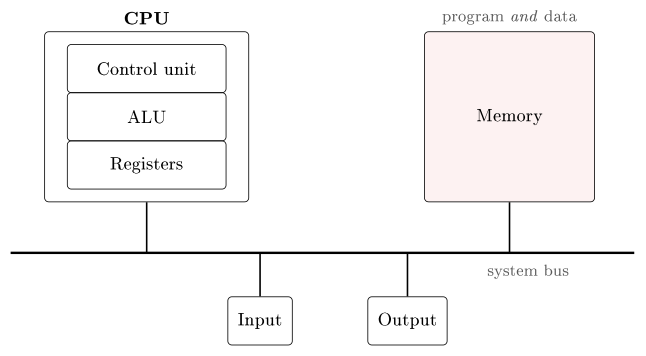
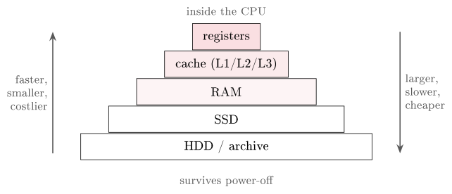

# How the machine computes {#sec-04-machine}

Lectures 1–3 showed how data is represented; now we open the box. The
question of this chapter is mechanical: Given bits in memory, how does a
computer actually *compute*? We build the answer from the bottom up -
from a single switch to gates, from gates to an adder, from the adder to
the Von Neumann machine, and finally through one complete instruction,
register by register. This is among the densest lectures of the course,
but it has a single thread you can hold on to throughout: *A computer is
many simple switches, arranged so that they fetch and carry out
instructions stored in memory.* Nothing more exotic than that.

## From the switch to the gate {#sec-04-gates}

Chapter 2 introduced the transistor as the reason for binary; here it
becomes a building material. A transistor is an electronic switch
controlled by a voltage, with no moving parts: Gate LOW, no current flows
- a 0; gate HIGH, current flows - a 1. Billions fit on one chip, each
switching billions of times per second, and everything in this chapter is
built from this one device.

Wire a few switches together and they can make *decisions*.

::: {#def-gates}
## Logic gates
A **logic gate** is a small transistor circuit computing a Boolean
operation on one or two input bits: **AND** outputs 1 only if both inputs
are 1; **OR** if either is; **XOR** if *exactly* one is; **NOT** inverts
its single input; **NAND** is AND followed by NOT.
:::

{#fig-gates}

These are the same bitwise operations you met arithmetically in
Chapter 2, now as hardware. The true/false algebra behind them is George
Boole's (1847); Claude Shannon's insight of 1938 was that Boole's algebra
maps *directly* onto electrical switching circuits - the founding
observation of digital electronics. One further fact is surprising enough
to deserve its own paragraph: A single gate type suffices to build all
the others. From NAND alone, $\mathrm{NOT}\,a = \mathrm{NAND}(a,a)$;
$a\;\mathrm{AND}\;b = \mathrm{NOT}(\mathrm{NAND}(a,b))$; and
$a\;\mathrm{OR}\;b = \mathrm{NAND}(\mathrm{NOT}\,a, \mathrm{NOT}\,b)$.
(NOR is universal in the same way.) Because one gate type suffices, a
chip can be manufactured from one repeated building block - an enormous
practical advantage.

::: {.callout-tip title="Worked exercise 4.1 - Only NAND"}
Build OR from NAND gates alone, and verify your construction on the input
$a = 1$, $b = 0$.

**Solution.** Using the formula above:
$a\;\mathrm{OR}\;b = \mathrm{NAND}(\mathrm{NAND}(a,a),
\mathrm{NAND}(b,b))$ - three NAND gates, wired like this:

{fig-align="center"}

Trace the values: $\mathrm{NAND}(1,1) = 0$ (upper gate, acting as
NOT $a$) and $\mathrm{NAND}(0,0) = 1$ (lower gate, NOT $b$); the final
gate computes $\mathrm{NAND}(0,1) = 1$. Indeed $1\;\mathrm{OR}\;0 = 1$.
:::

Gates make decisions; can they also do *arithmetic*? Yes, and the
construction is short enough to see whole.

::: {#exm-adder}
## The half-adder and the full adder
Add two bits $a + b$ and look at Chapter 2's addition table: The sum bit
is 1 exactly when *one* of the inputs is 1 - that is XOR - and the carry
bit is 1 exactly when *both* are - that is AND. So a *half-adder* is
nothing but an XOR gate and an AND gate side by side. It cannot, however,
accept a carry coming *in* from the column to its right. The *full adder*
fixes that: It adds three bits $a$, $b$ and a carry-in, with
$\text{sum} = a \oplus b \oplus c_{in}$ and carry-out = 1 whenever two or
more inputs are 1; internally it is two half-adders plus an OR gate. Now
chain eight full adders, carry-out to carry-in, and you have built the
8-bit adder that performs the byte addition of Chapter 2 - and, via two's
complement (@def-twoscomp), its subtraction too. Binary arithmetic, in
hardware, out of switches.
:::

The same gates, repeated and combined, go further still: Comparison
circuits test whether two values are equal or which is larger, and - the
trick that will matter in @sec-04-memaddr - feeding a gate's output back
to its own input lets it *hold* a bit: A flip-flop, the seed of memory. A
whole CPU is millions of these gates arranged with care; nothing more
exotic than switches.

## The Von Neumann architecture, properly {#sec-04-vonneumann}

Chapter 1 gave the blueprint in outline (@def-vonneumann); now we can
afford the full picture. The five hardware components are the *control
unit*, the *arithmetic logic unit* (ALU), *memory*, *input* and *output*
- where control unit, ALU and a handful of registers together form the
CPU. (The operating system, note, is software, not one of the five.)
Inside the CPU the division of labour is clean: The control unit reads
each instruction and issues the signals that carry it out; the ALU
performs the arithmetic and logic of the previous section - it is, quite
literally, built of the gates and adders above; the registers are a few
tiny, very fast stores for the values in use right now.

The defining idea deserves restating with the weight it carried in 1945.
Earlier machines were *rewired by hand* for each new task. Von Neumann's
insight - the *stored-program principle* - was to store the program in
the same memory as the data: The same hardware can then run any program,
just by loading different bits. A program is data that the CPU chooses to
interpret as instructions. Contemporaries summarised it in three words:
*Software was born*.

{#fig-vonneumann}

The design has a cost, and it has a name. Because every instruction *and*
every piece of data crosses the same single bus between CPU and memory,
the bus limits throughput: The CPU often waits on memory. This is the
*Von Neumann bottleneck*, and the caches of @sec-04-memaddr exist largely
to relieve it. The classical alternative, the *Harvard architecture*,
splits the paths - separate memories and buses for instructions and data,
accessible simultaneously and therefore faster - and survives in
microcontrollers and signal processors. Modern CPUs are a pragmatic
hybrid: Von Neumann as the programmer sees them, but with split
instruction and data caches inside.

Two amendments complete the modern picture. First, the *GPU*: A second
processor specialised for doing the same operation on lots of data at
once. Where the CPU has a few powerful cores tuned for varied, sequential
work, the GPU has thousands of small ones all performing the same step -
ideal for graphics and, today, for AI and other massively parallel
mathematics; it trades flexibility for sheer parallel throughput. Second,
*multi-core*: When clock speeds stopped rising (@sec-04-trends says why),
makers began packing several full cores onto one CPU, running different
programs - or parts of one - truly simultaneously. The catch is honest:
Software must be written to use the cores; not everything parallelises.

## The HIDAS cycle: One instruction, step by step {#sec-04-hidas}

Before watching the CPU run, one translation question. The CPU runs only
binary; how does `c = a + b;` become bits? In two steps: A *compiler*
translates the high-level statement into *assembly* - human-readable
mnemonics such as `ADD R3, R1, R2` - and an *assembler* turns each
mnemonic into *machine code*: A binary opcode naming the operation plus a
few bits naming the registers. The bits are the very same bits we met in
Chapter 2 - only now they are the program (the stored-program principle,
seen from below).

The cycle itself depends on a few special registers: The *program
counter* (PC) holds the memory address of the *next* instruction to
fetch; the *instruction register* (IR) holds the instruction currently
being carried out; the *accumulator* (A) holds the current working value.
Registers are the fastest memory in the machine - faster even than cache
- because they sit inside the CPU itself.

::: {#def-hidas}
## The HIDAS cycle
The CPU executes every instruction through five steps, repeated
endlessly: **H**olen (fetch the instruction at the address in PC into IR)
- **I**nkrementieren (increment PC to point at the next instruction) -
**D**ekodieren (decode: Work out what the instruction in IR means) -
**A**usführen (execute the operation) - **S**peichern (store the result).
The mnemonic keeps its German step names; @exm-fde in Chapter 1 was this
same cycle in its compressed three-step form, fetch–decode–execute, with
the increment and store steps folded in.
:::

::: {#exm-hidastrace}
## Tracing `LOAD 256`
Set the stage: Memory address 100 contains the instruction `LOAD 256`
("copy the value stored at address 256 into the accumulator"), address
256 contains the value 47, and the registers start at $\mathrm{PC}=100$,
IR and A empty. Now run one full cycle. **H**: The control unit puts
$\mathrm{PC}=100$ on the address bus and reads memory; `LOAD 256` comes
back and lands in IR. **I**: PC is increased to 101 - *now*, not later.
Why before executing? Because if this instruction turns out to be a jump,
the execute step will overwrite PC with the jump target; incrementing
afterwards would undo the jump. **D**: The control unit examines IR,
recognises the operation `LOAD` and the operand 256, and prepares the
control signals - no register changes. **A**: Memory at address 256 is
read, yielding 47. **S**: 47 is placed into A. End state:
$\mathrm{PC}=101$, $\mathrm{A}=47$, and the CPU returns to H.
:::

::: {.callout-tip title="Worked exercise 4.2 - Run one cycle yourself"}
Memory address 200 holds the instruction `LOAD 300`; address 300 holds
the value 13; the registers start at $\mathrm{PC}=200$, IR and A empty.
Walk through H–I–D–A–S and give the end state of PC, IR and A.

**Solution.** H: The instruction at address 200 - `LOAD 300` - is fetched
into IR. I: PC becomes 201. D: The control unit recognises `LOAD` with
operand 300. A: Memory at 300 is read, yielding 13. S: 13 lands in A. End
state: $\mathrm{PC}=201$, $\mathrm{IR}=\texttt{LOAD 300}$,
$\mathrm{A}=13$.
:::

What paces this loop is the *clock*: A steady pulse driving the CPU from
step to step. A 3 GHz CPU ticks three billion times per second; each
HIDAS step is paced by those ticks, and multiple cores run several such
cycles in parallel. Hold on to the perspective this gives: The whole
machine, however sophisticated, is this same tiny cycle repeated at
enormous speed.

::: {.callout-note title="Excursus - The CPU is an interpreter"}
Tanenbaum's favourite description of the HIDAS loop is worth carrying
around: The CPU is an *interpreter* - a tireless clerk running an endless
loop of "fetch the next order, work out what it says, do it, repeat".
Nothing about the clerk changes when the program changes; only the orders
do. That framing explains two things at once. First, why the
stored-program principle is so powerful: Swap the orders in memory and
the same clerk performs a completely different job. Second, why the
tower-of-levels picture from Chapter 1 works at all: Any level can be
realised by an interpreter running on the level below - exactly what a
Python interpreter, a Java virtual machine or an emulator for an old game
console does in software, and what the CPU itself does in hardware.
Interpretation all the way down.

*(Tanenbaum & Austin, 2013, ch. 1–2)*
:::

## Memory and addressing {#sec-04-memaddr}

Instructions need data, and the data lives in memory - which is best
pictured as one very long row of numbered cells, each holding one byte
and each carrying a unique *address*. The CPU selects a cell by placing
its address on the address bus. How much memory can it reach? With an
$N$-bit address bus, $2^N$ distinct locations: A 32-bit bus reaches
$2^{32} \approx 4$ billion bytes - 4 GB - which is precisely why 32-bit
systems topped out there, and one more reason the world moved to 64-bit
words (@def-bit).

One genuinely counter-intuitive subtlety hides in multi-byte values: In
which *order* are their bytes stored?

::: {#exm-endian}
## Endianness
Store the 32-bit value `0x12345678` at addresses 100–103. A
*little-endian* machine puts the least-significant byte at the lowest
address: 100 holds `78`, then `56`, `34`, `12`. A *big-endian* layout
stores them in reading order: `12 34 56 78`. Both denote the same value -
endianness is a convention, not a difference in meaning - but the
conventions collide exactly where data changes hands: X86 and ARM
processors are little-endian, while network protocols transmit big-endian
("network byte order"), a fact that returns in the networking modules.
:::

The working memory itself, RAM, is defined as much by what it is not. It
*is* volatile (contents lost at power-off), random-access (any cell
reachable in the same time) and much faster than SSD or HDD; it is *not*
permanent storage, and not as fast as the CPU's registers or cache.
Volatile is the word to underline: It is why unsaved work disappears when
the power fails - the work lived only in RAM.

RAM is one rung on the ladder you met in Chapter 1, the memory hierarchy:
Registers, cache, RAM, SSD/HDD - each level faster, smaller and costlier
than the one below. Now we can explain the rung between registers and RAM
properly. The *cache* is a small, fast copy of the data the CPU is most
likely to need next: A *cache hit* means the data is already there (very
fast); a *miss* means waiting for RAM. The startling fact is that hits
run at 90–99 % - because of *locality*: Programs tend to reuse the same
data (temporal locality) and nearby data (spatial locality), so a small
cache covers most accesses. The cache is how modern CPUs hide much of the
Von Neumann bottleneck. It comes in levels: L1, tiny and fastest, inside
each core (often split for instructions and data - the Harvard hybrid
from above); L2, larger, still per core; L3, largest, shared by all
cores. The CPU checks L1, then L2, then L3, then RAM, stopping at the
first level that holds the data.

{#fig-hierarchy}

At the bottom sits mass storage, large and non-volatile. The hard disk
(HDD) - spinning magnetic platters and a moving read head - is cheap per
gigabyte but slow and mechanical; the solid-state drive (SSD) - flash
memory, no moving parts - is much faster and more robust at a higher
price per gigabyte, and has largely replaced HDDs in laptops. And one
last hardware fact with a security-flavoured moral: Stored bits can
*flip* - cosmic rays and electrical noise occasionally do it - so *ECC
memory* adds check bits to every word and can detect, and usually
correct, a single flipped bit automatically. It is standard in servers,
where silent data corruption is unacceptable; the underlying idea returns
as the parity and CRC checks of the networking modules.

## Performance and trends {#sec-04-trends}

Step back, finally, to the trend behind all this growth - picking up the
timeline of Chapter 1 with the vocabulary to appreciate it. Moore's Law,
Gordon Moore's 1965 observation, held that transistor counts double
roughly every two years, and for decades it did: From the Intel 4004's
2 300 transistors (1971) through the Pentium 4's 42 million and the
Core i7's 1.2 billion to Apple's M-series at 16 and now 28 billion. On a
logarithmic scale the points fall on a straight line - exponential growth
- and any dashed continuation to 2030 (~50 billion) is an assumption, not
a measurement.

The second half of the story matters just as much. For decades, each
generation brought higher clock speeds essentially for free; around 2005,
rising heat capped the clocks, and designers added *cores* instead - the
multi-core turn of @sec-04-vonneumann. Today transistors approach atomic
scales, and the gains come from parallelism, from caches, and from
specialised silicon - GPUs, AI accelerators, chiplet designs - rather
than raw clock. The free lunch of ever-faster single cores is over;
performance now depends on *using many cores well*, which is a software
problem, and a fitting note on which to hand over to next week's subject.

Three two-minute checks from the lecture, worth redoing cold:
$1011\,0010\;\mathrm{XOR}\;1100\,1110$ (answer: $0111\,1100$ - and notice
it is @exm-adder's sum bits, byte-wide). A cycle starts at
$\mathrm{PC}=100$ with `LOAD 256`, and address 256 holds 9 - after one
HIDAS cycle, $\mathrm{PC}=101$ and $\mathrm{A}=9$. A 16-bit address bus
reaches $2^{16} = 65\,536$ locations.

**Before Lecture 5 (Operating systems).** Read the Module 5 chapter in
the textbook (`Readings.xlsx` for the pages). Try this: Open Task Manager
or Activity Monitor and watch how memory and CPU are shared among the
programs you have running. And think about the question that opens next
week: If the CPU can run only one HIDAS cycle at a time, how can a
computer *appear* to run many programs at once?

## Summary {#sec-04-summary}

Everything is switches: Transistors form gates (@def-gates); NAND alone
can build every logic function; XOR and AND side by side make a
half-adder, full adders chain into the byte arithmetic of Chapter 2
(@exm-adder), and a fed-back gate can even remember a bit. The Von
Neumann architecture arranges the result - control unit, ALU and
registers as the CPU, plus memory, input and output - around the
stored-program principle: Programs live in memory as data, so loading
different bits gives the same machine a different job, at the price of
the shared-bus bottleneck that caches exist to hide. Every instruction
runs through the HIDAS cycle (@def-hidas, @exm-hidastrace) - fetch,
increment, decode, execute, store - paced by a clock at billions of ticks
per second. Memory is addressed bytes: An $N$-bit bus reaches $2^N$
cells, endianness fixes the byte order (@exm-endian), RAM is fast and
volatile, and the hierarchy - registers, L1/L2/L3 cache, RAM, SSD/HDD -
turns locality into 90–99 % cache hit rates. And Moore's Law explains
both the eighty-year boom and the present turn: Clocks capped by heat,
gains now from cores and specialised chips. Next week: The software that
makes one machine appear to be many - the operating system.

## Interactive checks {#sec-04-interactive .unnumbered}

A round of quick interactive drills - instant feedback, all in your browser, nothing recorded. Every task has a show-solution button; clicking it straight away is no fun.

















## Self-check {#sec-04-self-check .unnumbered}

::: {#exr-04-nand}
## Building gates from NAND
Using only NAND gates, construct NOT and AND, writing each as a formula.
:::

::: {#exr-04-adder}
## Half-adder versus full adder
What exactly can a full adder do that a half-adder cannot - and why does
that one capability make multi-bit addition possible?
:::

::: {#exr-04-increment}
## Why increment before execute
In the HIDAS cycle, why is the program counter incremented *before* the
execute step rather than after it?
:::

::: {#exr-04-endian}
## Endianness in memory
The 32-bit value `0xA1B2C3D4` is stored little-endian at addresses
200–203. Which byte sits at address 200, and which at 203?
:::

::: {#exr-04-locality}
## Locality and the cache
Explain, using the two kinds of locality, why a cache far smaller than
RAM can nevertheless serve 90–99 % of memory accesses.
:::

::: {.callout-note collapse="true"}
## Sketch answers
(1) $\mathrm{NOT}\,a = \mathrm{NAND}(a,a)$; for AND, feed
$\mathrm{NAND}(a,b)$ into that NAND-built NOT:
$a\,\mathrm{AND}\,b = \mathrm{NOT}(\mathrm{NAND}(a,b))$. (2) Accept a
carry-*in*; only with it can adders chain carry-to-carry into an 8-, 16-
or 64-bit adder - the half-adder has no third input for the neighbouring
column's carry. (3) Because a jump instruction overwrites PC with its
target during execute; incrementing afterwards would destroy the jump.
Incrementing first makes "next instruction" the default that execute may
then override. (4) Little-endian stores the least-significant byte
lowest: Address 200 holds `D4`, address 203 holds `A1`. (5) Temporal
locality: Recently used data is likely to be used again, so keeping it
cached pays off; spatial locality: Nearby addresses are likely next, so
caches load whole neighbouring blocks. Together they concentrate most
accesses on a small working set that fits in the cache.
:::

::: {.bridge}
We now own the whole machine: Gates, adders, registers, and a CPU that
executes exactly one instruction at a time - and precisely there hangs
the question this chapter left open on purpose. How can such a machine
run a browser, a music player and a dozen background tasks at once?
Chapter 5 answers it with the operating system, built directly on the
hardware met here: The registers saved in every context switch, and the
interrupt that hands the machine back to its manager.
:::
