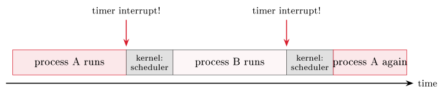
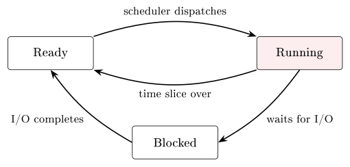

# Operating systems {#sec-05-os}

Chapter 4 ended with a machine that runs one instruction at a time - and
with a question deliberately left hanging: How can a laptop run a
browser, a music player and a dozen background tasks *at once*? That
illusion, and all the management behind it, is the job of the operating
system. The core idea of the chapter fits in one sentence: *The OS sits
between the hardware and your programs, sharing the machine's resources
safely and fairly.* We take it in five steps - what an OS is, how it runs
many programs on few cores, how it gives every program its own memory,
how it keeps data after power-off, and finally how you talk to it.

## What an operating system is {#sec-05-what-os-is}

The most useful definition looks at the same software from two directions
at once.

::: {#def-os}
## Operating system
Viewed **top-down**, an operating system is an *abstraction*: It hides
the messy hardware details and presents a simpler, uniform "virtual
machine" to programs and users - you click an icon; you do not toggle
voltages. Viewed **bottom-up**, it is a *resource manager*: It shares the
CPU, memory, storage and devices among programs, giving each one time and
space, and deciding who runs, when, and with what. Both views describe
the same software: It makes the machine *usable* (top-down) and
*shareable* (bottom-up).
:::

The OS's first gift is abstraction, and the best example is one you use
constantly: The *file*. Underneath, `report.pdf` is metadata (name, size,
dates, permissions) plus content (bytes on a disk); files are grouped
into directories; and the whole thing is shown to you as clickable icons
- not as block numbers on a disk. Chapter 1 promised that the mysteries
of this course are mostly agreed conventions; here the OS goes one step
further and *manufactures* a convenient fiction for you.

Architecturally, the OS sits between the hardware and the applications:
Everything an application does on the hardware goes through it - through
its process manager, memory manager, device manager (the drivers) and
file manager. And the doorway is deliberately narrow.

::: {#def-syscall}
## System call
A program cannot touch the disk or network directly - that would be
unsafe. Instead it makes a **system call**: A request such as "open this
file" or "send these bytes". The CPU switches into kernel mode, the OS
does the work and checks permissions, and returns the result.
:::

Reading a file, opening a window, starting a program - each is a system
call underneath, and this guarded boundary is what keeps the system safe.
The full job list of an OS then reads: Provide a user interface (shell or
GUI); provide programming interfaces - the *API*, the set of calls a
program uses to ask for OS services without touching hardware; manage
resources (CPU, memory, storage, I/O); manage devices through *drivers* -
small programs that teach the OS how to talk to one device, so that
applications can use the same simple read and write operations regardless
of the hardware underneath; handle networking and security; and organise
the file system. A one-paragraph history shows the direction of travel:
Batch processing in the 1950s (one job at a time), time-sharing in the
1960s–70s (many users, one machine, interactively), personal computers
with graphical desktops in the 1980s–90s, and mobile and cloud since the
2000s (sandboxed apps; fleets of servers managed as one system). The
trend never reversed: Each step let more programs and people share the
same hardware more safely.

## Processes and scheduling {#sec-05-processes}

Three terms carry the rest of the chapter.

::: {#def-process}
## Process, thread, resource
A **process** is a program *in execution*, together with the resources it
is using - its memory, open files and current state. A **thread** is a
single "thread of control" inside a process: One sequence of instructions
executed one after another; a process can have several. A **resource** is
anything a program needs to run - CPU time, RAM, files, network, I/O
devices.
:::

The distinction to internalise: A program on disk is passive; a process
is that program *running*, with a slice of the machine assigned to it.
Threads let one process do several things at once - a browser tab can
load a page on one thread while another keeps the interface responsive -
and threads of the same process *share its memory*, which is powerful and
risky in equal measure. If two threads update the same variable at the
same time, the result depends on timing: A *race condition*. The OS
therefore offers *locks*, so only one thread enters a critical section at
a time; getting this right is one of the hardest parts of systems
programming.

Now the headline question. Each CPU core runs one instruction at a time -
Chapter 4 was emphatic about it - yet many programs seem to run together.
The answer is *multitasking*: The OS rapidly switches the core between
processes, a few milliseconds each, far too fast to notice, so they
appear simultaneous; several cores additionally run several processes
*truly* in parallel. The switching is the work of two mechanisms worth
naming precisely. The *scheduler* is the part of the OS that decides
which ready process runs next. A *context switch* is the act of swapping
processes on a core: Save the current process's state (registers, program
counter - the very registers of Chapter 4), load the next process's saved
state, resume it where it left off. Each switch costs a little time; too
many waste the CPU on bookkeeping instead of real work, so schedulers
balance responsiveness against overhead.

One question hides inside that description, and it is the best question
in the chapter: While a process is running, *the OS is not* - the core is
busy executing the process's instructions, one HIDAS cycle after another,
and nothing in Chapter 4's loop ever says "now hand over to the operating
system". So how does the OS ever get the CPU back to make its scheduling
decision? A greedy or crashed program certainly will not volunteer. The
answer is a piece of *hardware*: The **timer interrupt**. A small clock
circuit on the chip is programmed by the OS to fire at regular intervals
- typically every few milliseconds - and when it fires, the CPU itself,
in hardware, suspends whatever it was doing, saves where it was, and
jumps to a fixed OS routine in kernel mode. From there the OS is in
charge: It can note that the time slice is over, run the scheduler, and
context-switch to the next process. No program can prevent this, because
no program is asked - the interrupt is wired into the machine below the
level any software runs on. The same mechanism, triggered by devices
instead of the clock, is what ends a process's wait: When the disk
finishes a read, the disk controller raises an *interrupt*, the OS
briefly gets the CPU, and moves the blocked process back to ready.
Multitasking, in other words, is not a clever program; it is a clock with
the right to interrupt anything.

{#fig-timerint}

::: {.callout-note title="Excursus - Interrupts, and the two faces of an OS"}
Both key ideas of this chapter are stated memorably in Tanenbaum and
Bos's *Modern Operating Systems*, the standard text on the subject for
four decades. The two-sided @def-os is theirs almost verbatim: The OS as
an *extended machine* (top-down - a cleaner, safer computer than the real
one) and as a *resource manager* (bottom-up - time and space multiplexed
among competing programs). And their treatment of interrupts earns the
timer its proper place in history: Early batch systems could be
monopolised by a single looping program until an operator physically
intervened; the hardware timer is what made true time-sharing possible in
the 1960s, because for the first time the machine itself guaranteed the
OS would regain control. One more Tanenbaum observation to file away: Old
ideas in computing rarely die - they return whenever the technology
shifts (he calls it "ontogeny recapitulates phylogeny"). Batch
processing, for instance, was declared obsolete by interactive computing
- and lives on happily in every data centre's overnight jobs.

*(Tanenbaum & Bos, Modern Operating Systems, 4th ed., 2014, ch. 1–2)*
:::

How does the scheduler choose? Three classic strategies span the design
space. *Round-robin* gives each process a fixed time slice in turn - fair
and responsive, the workhorse of interactive systems; a shorter slice
feels snappier but costs more context-switch overhead.
*First-come-first-served* runs processes in arrival order - simple, but
one long job delays all the rest. *Priority* scheduling runs important
processes first, with priorities static or dynamic. Real systems combine
these - for instance priority levels, each scheduled round-robin - to
balance fairness, responsiveness and throughput.

At any moment, each process is in one of three states: *Running* (using a
core right now), *ready* (able to run, waiting its turn in the queue), or
*blocked* (waiting for something - a disk read, say - and unable to use
the CPU until it arrives). The scheduler dispatches ready processes; I/O
waits move them to blocked; completion of the wait moves them back to
ready.

{#fig-procstates}

::: {.callout-tip title="Worked exercise 5.1 - Name the state"}
Classify each situation: (a) a video encoder is crunching frames on
core 3 right now; (b) a text editor has work to do but all cores are busy
with other processes; (c) a download manager has asked the network card
for data and cannot continue until it arrives. And: Which event moves
process (c) onward, and into *which* state?

**Solution.** (a) running - it holds a core. (b) ready - runnable,
queued, waiting for the scheduler. (c) blocked - waiting for I/O, unable
to use a core even if one were free. When the network data arrives, the
interrupt lets the OS move (c) to *ready* - not straight to running; it
still has to be dispatched.
:::

Two dangers close the section. The first is the *deadlock*: Process A
holds resource 1 and wants resource 2; process B holds resource 2 and
wants resource 1; both wait for the other - forever. The OS can prevent,
avoid, or detect and recover from deadlocks, but the pattern is a classic
risk wherever processes compete for limited resources. The second is
guarded against by hardware: The CPU runs in one of two privilege levels.
In *user mode* - normal applications - there is no direct access to
hardware or drivers, only the memory the OS granted, and a restricted
instruction set; anything dangerous must go through the API. In *kernel
mode* - the core of the OS - every instruction is allowed and all memory
is reachable, with no hardware protection: A bug here can crash the
machine. This split is why one misbehaving app usually cannot take down
the whole system: It is boxed into user mode.

::: {#exm-taskmgr}
## Watching it happen
None of this is hidden. Windows ships Task Manager (Ctrl-Shift-Esc),
macOS ships Activity Monitor, and Linux offers `ps` (a snapshot), `top`
(live), and the `/proc` filesystem, where processes are exposed as files.
Open one now and count: Even an "idle" machine runs dozens of processes -
the resident parts of the OS, services, and the background halves of your
applications. Watch the CPU column for a minute and you are watching the
scheduler make its millisecond decisions in aggregate. The Practice
session does exactly this, hands-on.
:::

## Memory management {#sec-05-memory}

To execute, a process's instructions and data must be in memory: Its code
and data sit in RAM while it runs - and note that *the OS is a program
too*; part of it stays resident in memory at all times. (The cache of
Chapter 4 sits between CPU and RAM as before; nothing here replaces it.)
The memory manager's job is threefold: Hand out RAM to processes, keep
them from reading each other's memory, and reclaim it when they finish.
Its central trick has a name.

::: {#def-virtualmem}
## Virtual memory
Under **virtual memory**, every process is given a private,
continuous-looking address space; the OS maps each process's *virtual*
addresses to real locations in RAM. Processes feel alone with the whole
memory, but are kept safely separate.
:::

Virtual memory can even be *larger* than the physical RAM installed.
Memory is handled in fixed-size blocks called *pages*; rarely-used pages
can be moved out to disk to free RAM - *swapping* - and brought back when
the process needs them. The catch is the memory hierarchy of Chapter 4:
Disk is far slower than RAM, so a little swapping is fine, but heavy
swapping ("thrashing") makes a machine crawl - which is exactly why
adding RAM often speeds up a busy computer: Less needs to be pushed out
to the slow disk.

The protective half of the same mechanism: Each process may only touch
the memory the OS mapped for it; an attempt to step outside is caught by
the hardware and the OS, and the offending process is stopped - the
familiar "segmentation fault". This isolation is why a crash in one
program usually leaves the rest of the system, and your other work,
untouched.

## Files and storage {#sec-05-files}

Memory is temporary; RAM forgets everything at power-off (Chapter 4's
*volatile*). For anything we want to keep, the OS writes to permanent
storage - SSD or HDD - organised as directories and files. "Save",
precisely, means: Copy from volatile RAM to non-volatile storage, through
the file system.

The file system arranges files and folders as a tree, rooted (on
Unix-like systems) at `/`, with each file carrying its metadata: Name and
type, size and location, access rights, creation and modification dates.
Behind the tidy tree, the file manager must guarantee four hard things:
*Safe storage* (write data reliably onto the devices), *sharing* (let
multiple users and programs use data in a controlled way), *protection*
(guard against errors, crashes and malicious users), and *concurrency
control* - locks again, this time so two writers cannot corrupt the same
file at once. Much of this is invisible until it fails, which is exactly
why the OS works hard to make sure it does not.

The visible half of protection is *permissions*: Every file records
access rights, typically for three actions - read (view the contents),
write (change or delete it), execute (run it as a program) - granted to
the owner, a group, and everyone else. Permissions are a first line of
security: They stop one user, or a careless program, from reading or
wrecking another's data. (And now the octal aside of Chapter 2 pays off:
`chmod 755` is exactly these three-times-three bits, written in the base
whose digits are three bits each.)

## The user's view {#sec-05-users-view}

How do *you* drive all this? Through one of two front-ends to the same
OS. The *shell* is the text interface: You type a command, the OS
responds - start and stop programs, move and copy files, inspect the
system, and automate repetitive work with scripts, which is why servers
and developers rely on it. The GUI is the graphical alternative. Every
system ships both: Windows pairs Explorer with `cmd.exe` and PowerShell;
macOS pairs Finder with `zsh`/`bash` in Terminal; Linux pairs its file
managers with `bash` and friends. Pick whichever suits the task - they
are two doors into the same house.

The same core job, finally, is tuned for very different machines. Desktop
systems (Windows, macOS, Linux) optimise general use and responsiveness;
servers (Linux, Windows Server) optimise throughput, uptime and many
users; mobile systems (Android, iOS) optimise battery, touch and app
sandboxing; embedded and real-time systems (RTOS, embedded Linux) fit
tiny devices with strict timing. Family resemblances run deep: Android is
built on the Linux kernel, and macOS and iOS share a Unix core - the same
principles scale from a watch to a data centre.

One last question ties the machine and its manager together: How does the
OS itself get started? A short chain hands control upward at power-on:
The firmware (BIOS/UEFI) checks the hardware and starts a *boot loader*;
the boot loader loads the *kernel* into memory; the kernel takes over and
starts the rest of the system, up to the login screen or desktop. From
there on, everything in this chapter is in play.

**Before Lecture 6 (The Internet).** Read the Module 6 chapter in the
textbook (`Readings.xlsx` for the pages). Try this: Open a terminal, run
`ping`, and then look up your machine's IP address. And think about the
question the next chapter opens with: When you open a web page, your
request leaves your computer - how does it find the right server among
billions of machines?

## Summary {#sec-05-summary}

The operating system is abstraction plus resource management (@def-os):
It hides the hardware behind files, windows and APIs, and shares the
machine through the guarded doorway of system calls (@def-syscall). A
process is a running program (@def-process); the scheduler shares the CPU
among many of them through rapid context switches - round-robin,
priorities and their combinations - creating the simultaneity that
Chapter 4's single-cycle machine could not provide, while user mode
versus kernel mode keeps the sharing safe. Virtual memory
(@def-virtualmem) gives each process its own address space, extends RAM
onto disk through paging and swapping, and enforces the isolation behind
the humble segmentation fault. The file system makes data survive
power-off: A tree of files with metadata, permissions and locks. And
shells, GUIs and OS families are all front-ends and variations on this
same design - booted, at power-on, by a firmware-to-kernel chain. Next
week the single machine ends: We connect them.

## Interactive checks {#sec-05-interactive .unnumbered}

A round of quick interactive drills - instant feedback, all in your browser, nothing recorded. Every task has a show-solution button; clicking it straight away is no fun.













## Self-check {#sec-05-self-check .unnumbered}

::: {#exr-05-two-views}
## The two views of an OS
State the two views of an operating system, and give one concrete example
of each from your own computer use today.
:::

::: {#exr-05-syscalls}
## System calls and kernel mode
Why must a program use a system call to read a file rather than accessing
the disk directly - and which CPU mechanism from this chapter enforces
that?
:::

::: {#exr-05-blocked}
## The blocked state
A process is blocked. What does that mean, what typically caused it, and
what has to happen before the scheduler will consider it again?
:::

::: {#exr-05-thrashing}
## Virtual memory and thrashing
Your computer has 8 GB of RAM but the processes you run request 12 GB in
total, and everything still works - slowly. Name the mechanisms involved
and explain the slowness.
:::

::: {#exr-05-race}
## Race conditions and locks
Two threads of one process increment the same counter "simultaneously"
and updates go missing. Name the problem and the OS-provided remedy.
:::

::: {.callout-note collapse="true"}
## Sketch answers
(1) Top-down, abstraction: You saved "a file" without knowing any disk
block numbers. Bottom-up, resource management: A dozen programs shared
your CPU cores today without you assigning time to any of them.
(2) Direct disk access would bypass all permission checks and could
corrupt shared state; the user-mode/kernel-mode split makes privileged
operations impossible outside the kernel, so the program must request
them via a system call. (3) It is waiting for something - typically I/O
such as a disk read - and cannot use the CPU; when the awaited event
completes, the OS moves it back to *ready*, and only then can the
scheduler pick it. (4) Virtual memory with paging and swapping: Rarely
used pages are moved to disk and fetched back on demand; since disk is
orders of magnitude slower than RAM, heavy swapping (thrashing) dominates
the runtime. (5) A race condition; the OS provides locks so that only one
thread at a time enters the critical section that updates the counter.
:::

::: {.bridge}
The single computer is now complete: Hardware (Chapter 4) plus the
operating system that shares and protects it (Chapter 5). Useful - but
alone. Building on the abstraction idea at the heart of the OS, Chapter 6
connects machines: The internet as a network of networks, organised in
layers that hide each other's details exactly as the OS hides the
hardware's.
:::
