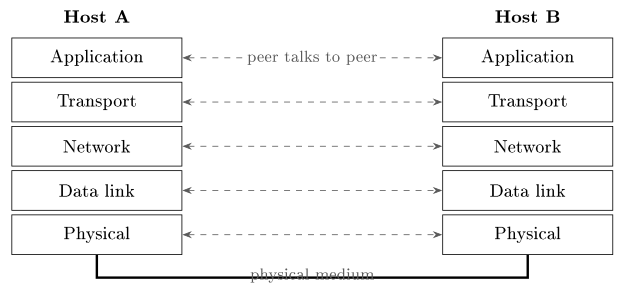
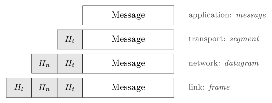

# The Internet {#sec-06-internet}

We now have a complete single computer: Hardware (Chapter 4) plus an
operating system that shares it (Chapter 5). Useful - but isolated. From
here to the end of the course the subject is networks: How billions of
these machines find each other and exchange data. This chapter draws the
big picture whose details fill Lectures 7–10, and its core idea deserves
stating up front: *The Internet is a network of networks, and it works
because everyone follows the same layered set of protocols.* By the end
you will be able to trace a single web-page load through five layers -
and watch it happen with tools on your own machine.

## The internet and the web {#sec-06-internet-web}

::: {#def-internet}
## The internet
The internet is not one network but a vast **network of networks**:
Independent networks - homes, campuses, companies, carriers - joined
together. It has no central owner; the networks cooperate by following
shared protocols, and any machine can reach any other, network to
network. The word itself says it: *Inter-net*, a link between networks.
:::

The component networks are classified mainly by reach: A PAN covers a
person or a desk (Bluetooth earbuds); a LAN a building or campus (home
Wi-Fi, an office network); a MAN a city; a WAN a country or the world -
and the internet is the largest WAN of all, built by interconnecting
countless LANs and other networks. Zoom out over any such network and two
regions appear: The *edge* - the end systems, clients and servers, where
the users sit - and the *core* - the mesh of routers that forwards data
between them.

Inside that core, there are two fundamentally different ways to move
data, and the old telephone network and the internet made opposite
choices. *Circuit switching* reserves a dedicated path for the whole
call: Guaranteed capacity, but wasted whenever the line is idle. *Packet
switching* - the internet's choice - splits data into packets, each
routed on its own, with links shared on demand. Packet switching wins
when traffic is bursty, as most data traffic is: No one sits on idle
capacity, and the network degrades gracefully under load.

::: {.callout-note title="Excursus - The middle ground: Virtual circuits"}
Between the two pure designs lies a third, worth knowing because it keeps
returning. A *virtual circuit* sets up a path through the network before
data flows - like a telephone call - but then sends *packets* along that
fixed path, with no capacity reserved: The connection is an agreement in
the routers' tables, not a copper wire. Classic wide-area technologies
such as X.25 and Frame Relay worked this way, and Dostálek and Kabelová
treat them at length because much of the pre-internet data world ran on
them. The pure datagram design won the internet - every packet
independent, no setup, maximal resilience - but the virtual-circuit idea
never died: Modern carrier backbones use label switching (MPLS) to pin
packet flows to predictable paths for exactly the old reasons, guaranteed
capacity and simple forwarding. Old ideas in networking, as in operating
systems, recur whenever the technology shifts.

*(Dostálek & Kabelová, Understanding TCP/IP, 2006, ch. 1)*
:::

That efficient, shared design is part of why the internet could grow as
it did: From ARPANET, the first packet-switched network, in 1969; through
TCP/IP (1974–83), the common protocol that let networks join; DNS in
1983, names instead of raw addresses; the World Wide Web in 1991, which
made it usable for everyone; to the always-on mobile-and-cloud era -
roughly two-thirds of humanity online today, heading past six billion
users. Each step added usefulness on the same idea: Independent networks,
cooperating through shared protocols.

Two distinctions before moving on, because everyday language blurs both.
First, the internet carries *many* services - the web (HTTP), e-mail
(SMTP/IMAP), file sharing (FTP), streaming, voice calls, DNS, VPNs - each
a separate application protocol on the same infrastructure; Chapter 7
meets several of them. Second, therefore: *The internet is not the web*.
The internet is the infrastructure; the web - invented 1989–90 by Tim
Berners-Lee at CERN, opened to all in 1991, built on HTTP for transfer
and HTML for page structure, with CSS added in 1994 by Håkon Wium Lie,
also at CERN - is one service running on it, alongside the rest.

Who physically connects it all? Internet Service Providers, arranged in
tiers: Your *access ISP* connects you upward to *regional* providers,
which connect to the *tier-1* global backbones; large networks also peer
directly at internet exchange points. Every link in that chain works only
because both ends follow the same rules - which is the next section's
subject.

## Protocols {#sec-06-protocols}

::: {#def-protocol}
## Protocol
A **protocol** is a shared set of rules for exchanging messages - the
etiquette of a machine conversation. Both sides must speak the same
protocol, in the same order, or the exchange fails, exactly as two people
need a shared language.
:::

What must such a set of rules pin down? Far more than "what to say": The
*data format* (how a message is structured), *addressing* (who is
sending, who receives), *error handling* (detecting and recovering from
damage), *flow control* (not overwhelming the receiver), *timing* (when
to send and how fast) and *sequencing* (putting pieces back in order).
Think of posting a parcel: The address, the box, what happens if it is
damaged, how fast the post office can accept them - a protocol settles
all of that, for data. The classic summary compresses these into three
words borrowed from the study of language: *Syntax* (the form - word
order, data formats), *semantics* (the meaning - what each control field
means and how to react) and *timing* (the when - matching both sides'
speeds). Get any one wrong and communication breaks; a correctly spelled
message at the wrong time is still a failure.

Who writes the rules down? Open bodies, so that anyone can implement
them: The IETF (Internet Engineering Task Force) develops internet
protocols, publishing each standard as a numbered RFC (Request For
Comments); IANA (Internet Assigned Numbers Authority) hands out the
global numbers - IP address blocks and the top-level domains. Because the
rules are public, a phone, a laptop and a server from different makers
interoperate; no single company owns "how the internet talks".

## Layered models {#sec-06-layers}

One protocol per task is fine - but a full conversation needs many at
once, and the way to keep them organised is the single most important
design idea of the networking half of this course: *Layers*. Split one
impossible job into a stack of small, independent ones: Each layer does
one job and offers a service to the layer above; a layer can be swapped
out - Wi-Fi for cable - without touching the others; and each layer talks
to its *peer* on the other machine, as if directly. If that sounds
familiar, it should: It is the same idea as abstraction in the operating
system (@def-os) - hide the details below, present a clean service above.

Two standard ways of slicing the stack have become the references. The
OSI model describes seven layers and is the teaching reference; the
TCP/IP model describes four or five and is what the internet actually
runs. This course uses the five-layer version, in which OSI's top three
layers (application, presentation, session) fold into one "application"
layer:

::: {#def-stack}
## The five-layer stack
From top to bottom: **Application** (the programs' conversation - HTTP,
DNS, …), **transport** (a reliable stream between processes - TCP),
**network** (end-to-end routing across networks - IP), **data link**
(neighbour to neighbour - Ethernet, Wi-Fi), **physical** (the actual
signal - cable, plug, radio). Lectures 7–10 take these one layer at a
time, from the top down.
:::

{#fig-stack}

The bottom layer rests on a physical medium, and the choices matter:
Wired media - twisted-pair copper (Ethernet; cheap and common), coaxial
cable (cable broadband), optical fibre (light; huge capacity over long
distance) - and wireless - Wi-Fi for local radio, cellular 4G/5G for
wide-area mobility, satellite for remote and global coverage. Each trades
off speed, distance, cost and reliability: Fibre for backbones, radio for
the last hop to your phone.

Whatever the medium, three numbers describe how a connection feels.
*Bandwidth* is the maximum rate a link could carry, in bits per second -
the width of the pipe. *Throughput* is the rate you actually get, after
overhead and sharing. *Latency* is the delay for one bit to travel end to
end; in practice it is usually measured as the *round-trip time* (RTT) -
there and back - which is what `ping` reports. Keep bandwidth and delay
apart in your head: A fat satellite link can still take half a second per
round trip, and high bandwidth with high latency *feels* slow. Latency
itself decomposes into four pieces, incurred at every hop: *Processing*
delay (the router reads the header and decides the next hop), *queuing*
delay (waiting behind other packets on the link), *transmission* delay
(pushing all the bits onto the link) and *propagation* delay (the signal
physically travelling the distance). Queuing is the one that varies most
- it grows as the link gets busy, which is exactly the congestion that
TCP fights in Chapter 8.

## Encapsulation {#sec-06-encapsulation}

How does one message actually pass through all five layers?

::: {#def-encapsulation}
## Encapsulation
Going *down* the stack, every layer wraps the data from above with its
own **header** carrying that layer's control information - like putting a
letter into ever-larger labelled envelopes. The receiver opens them in
the reverse order on the way *up*.
:::

::: {#exm-journey}
## The journey down, then up
Put sender and receiver side by side. The application hands its message
to transport, which prepends its header; the network layer prepends its
own; the link layer its own; and the result crosses the wire as a signal.
On the receiving machine the unwrapping runs in exactly the reverse
order, each layer reading and removing its peer's header. The lecture's
analogy is air travel: Buy a ticket, check the bag, board, fly - and on
arrival the steps are undone in reverse, land, leave the plane, collect
the bag - each handled by the matching department. Crucially, each layer
only "talks to" the same layer on the other side: The transport layers
converse through their headers without caring what carried them.
:::

{#fig-encaps}

Because each layer adds its own wrapper, the same data gets a new name at
each step, and the names are worth learning now because the next four
chapters use them constantly: At the application layer it is a *message*;
transport wraps it into a *segment* (adding port numbers - *which
process*); the network layer into a *datagram* or packet (adding IP
addresses - *which host*); the link layer into a *frame* (adding hardware
addresses - *which neighbour*). Hear the word, know the layer - and know
which kind of address is in play.

::: {.callout-tip title="Worked exercise 6.1 - Hear the word, know the layer"}
For each observation, name the layer and the data unit: (a) Wireshark
shows destination port 443; (b) a header carries the addresses
`3C:5A:B4:1F:9E:02` and `A0:11:75:2C:00:1B`; (c) a header carries
`158.36.10.4` as its destination; (d) the payload reads
`GET /index.html HTTP/1.1`.

**Solution.** (a) ports $\Rightarrow$ transport layer, *segment*.
(b) MAC addresses $\Rightarrow$ link layer, *frame*. (c) an IP address
$\Rightarrow$ network layer, *datagram*. (d) protocol text $\Rightarrow$
application layer, *message*.
:::

## Seeing the network {#sec-06-tools}

None of this is theory you must take on faith; five small commands reveal
most of what your machine is doing, and each lives at a layer we just
met. `ping` answers "can I reach that host, and how fast?" - it sends a
small packet and reports whether a reply came and the round-trip time
(network layer). `traceroute` (Windows: `tracert`) answers "what path do
my packets take?" - it lists every router along the way and shows where a
connection slows or stops (network layer); these two are the first
commands to reach for when "the internet is down". `nslookup` and `dig`
answer "what IP is behind this name?" - a direct DNS query (application
layer). `ipconfig`/`ifconfig` shows your own machine's settings -
address, gateway (link/network). `netstat` lists your open connections
with their addresses and port numbers (transport).

When you need to go deeper than any of them, *Wireshark* - a "packet
sniffer" - captures the frames passing through an interface and lets you
open each packet and read its headers, layer by layer: It turns the
encapsulation diagram of @exm-journey into something you can watch live.
A typical capture of a page load reads like the course so far in four
lines: A DNS query and its answer, a TCP SYN to port 443, a TLS Client
Hello. Wireshark is a powerful tool - and a standing reminder that
*unencrypted traffic is readable by anyone on the path*. That thought
deserves its own paragraph: An open, shared network is convenient and
exposed. The classic threats are eavesdropping (reading traffic on the
path), spoofing (faking a source address) and denial of service (flooding
a target); the classic defences are encryption (TLS - unreadable in
transit), authentication (proving who you are) and firewalls (filtering
unwanted traffic). This is why so much of the modern internet is
encrypted by default - a theme Chapter 7 picks up with HTTPS.

::: {#exm-pageload}
## Loading a web page
One address typed; every idea of the chapter plays a part. (1) *DNS*
turns the name into an IP address - application layer. (2) *TCP* opens a
reliable connection to the server - transport. (3) *IP* routes the
packets hop by hop across networks - network layer. (4) Each packet is
*encapsulated* into frames and sent over the medium - link and physical.
(5) *HTTP* carries the request and the page back, and the browser renders
it. Protocols, layers, encapsulation, routing - all in the half-second
before a page appears. Keep this five-step trace; Lectures 7–10 are, in
effect, a slow-motion replay of it, one layer per week.
:::

**Before Lecture 7 (The application layer).** Read the Module 7 chapter
in the textbook (`Readings.xlsx` for the pages). Try this: Run
`traceroute` (or `tracert`) to a website and count the hops. And think
about the question that opens the next chapter: When you type a web
address, what has to happen before the page can even be requested?

## Summary {#sec-06-summary}

The internet is a network of networks (@def-internet): Hosts at the edge,
routers in the core, packet-switched because bursty traffic shares links
best - and the web is one service running on it, not the thing itself.
Protocols are the agreed rules (@def-protocol) - syntax, semantics,
timing - published openly as RFCs so that everyone can interoperate.
Layers tame the complexity (@def-stack): Application, transport, network,
link, physical, each serving the layer above and conversing with its peer
opposite - the OS's abstraction idea, applied to communication.
Encapsulation (@def-encapsulation) carries one message down through
message, segment, datagram and frame, and back up in reverse
(@exm-journey). And simple tools - `ping`, `traceroute`, `dig`,
`ipconfig`, `netstat`, Wireshark - let you watch all of it on your own
machine (@exm-pageload). Next week we zoom into the top layer, where your
programs actually do the talking.

## Interactive checks {#sec-06-interactive .unnumbered}

A round of quick interactive drills - instant feedback, all in your browser, nothing recorded. Every task has a show-solution button; clicking it straight away is no fun.













## Self-check {#sec-06-self-check .unnumbered}

::: {#exr-06-internet-web}
## The internet versus the web
Explain the difference between the internet and the web in two sentences
- one for each.
:::

::: {#exr-06-switching}
## Packet versus circuit switching
Why did the internet choose packet switching over circuit switching? Name
the traffic property that decides it.
:::

::: {#exr-06-layers}
## Layers and data units
Name the five layers of the stack and the data-unit name at each of the
middle three.
:::

::: {#exr-06-latency}
## Bandwidth versus latency
A friend's satellite connection has very high bandwidth, yet video calls
feel sluggish. Which of the three performance numbers explains it, and
which of the four delay sources dominates?
:::

::: {#exr-06-tools}
## Choosing the right tool
Which tool would you use to answer each question: Is the server
reachable? Where along the path does it stop? What address is behind the
name? Which connections does my machine have open right now?
:::

::: {.callout-note collapse="true"}
## Sketch answers
(1) The internet is the infrastructure: A network of networks moving
packets. The web is one application-layer service on it, moving pages
over HTTP - alongside e-mail, streaming and the rest. (2) Data traffic is
bursty; packet switching shares links on demand so no one holds idle
capacity, and it degrades gracefully under load, whereas a reserved
circuit wastes capacity whenever the sender pauses. (3) Application,
transport, network, data link, physical; segment (transport), datagram
(network), frame (link). (4) Latency - specifically propagation delay:
The signal's physical travel to a satellite and back can approach half a
second per round trip regardless of the pipe's width. (5) `ping`;
`traceroute`; `nslookup`/`dig`; `netstat`.
:::

::: {.bridge}
The map is drawn: Layers, protocols, encapsulation, and one page load
traced through all five levels. From here the course descends the stack
one layer per chapter, starting at the top. Chapter 7 opens the
application layer - DNS, HTTP, e-mail and file transfer: The actual
conversations that everything below exists to carry.
:::
