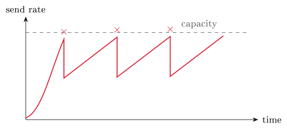

# The transport layer {#sec-08-transport}

Chapter 7 ended on a deliberate tension: HTTP needs every byte to arrive,
in order; a video call does not - a late frame is worthless, a missing
one barely noticed. The transport layer resolves the tension by offering
*two* delivery services and letting each application choose: Reliable
TCP, and lean, fast UDP. The chapter's core idea in one line: *The
transport layer connects processes, not just machines, and lets an app
choose reliability or speed.* Everything begins with one small idea the
network layer lacks - the port.

## Transport basics: Ports and sockets {#sec-08-ports}

What does the transport layer add on top of the network below it? The
network layer (Chapter 9's subject) reaches the right *machine*;
transport reaches the right *process* on it. It runs on the end machines
only - not in the routers between them - and it gives an application the
illusion of a private, logical channel to a specific process on another
host: The app just reads and writes bytes, transport cuts them into
*segments*, addresses them, and hands them to IP. Your laptop runs dozens
of network programs at once; transport is what keeps their data from
getting mixed up.

That un-mixing has a name pair: *Multiplexing* gathers data from many
processes into one channel on the sender; *demultiplexing* splits
arriving data back to the right process on the receiver. For
demultiplexing to work, every segment must name its process - which is
exactly what ports are for.

::: {#def-port}
## Port, socket
A **port** is a 16-bit number carried in every segment header (source and
destination) that identifies a process on a host; an IP address finds the
host, the port finds the program. The pair *IP address + port* is one
endpoint of a conversation and is called a **socket**, written `IP:port`.
A TCP connection is named by its *pair* of sockets - the four values
source-IP, source-port, destination-IP, destination-port.
:::

Sixteen bits give 65 536 ports, split by convention: 0–1023 are the
*well-known* ports of standard services; 1024–49 151 are registered to
applications; 49 152–65 535 are *ephemeral* - temporary, chosen by
clients. The well-known numbers worth memorising, since they recur in
every lab and exam: 20/21 FTP, 22 SSH, 25 SMTP, 53 DNS, 67/68 DHCP, 80
HTTP, 110 POP3, 143 IMAP, 443 HTTPS. Loading a page, the server listens
on its fixed 443 while your machine picks a random ephemeral port for its
own end - so the connection might be `10.0.0.5:51000` ↔ `93.1.2.3:443`:
Two sockets, one conversation.

Before the details, the two protocols side by side. TCP performs a
handshake first, guarantees ordered delivery, and pays for it in
overhead; UDP has no connection at all, delivers best-effort, and costs
almost nothing. TCP suits the web, mail and files; UDP suits media, DNS
and games. Neither is "better": The application picks the trade-off that
fits its needs from Chapter 7's table - and both ride on IP underneath.

::: {.callout-tip title="Worked exercise 8.1 - TCP or UDP?"}
Pick the transport protocol for each application, with a one-clause
reason: (a) downloading a software update; (b) the voice channel of an
online game; (c) a DNS lookup; (d) submitting your arbeidskrav through
Canvas.

**Solution.** (a) TCP - one flipped byte corrupts the whole installer, so
loss is unacceptable. (b) UDP - a glitch beats a stall; late audio is
worthless. (c) UDP - one small question, one small answer; a lost query
is simply re-asked. (d) TCP - it rides on HTTPS, and your submission must
arrive complete and in order.
:::

## UDP: The minimal option {#sec-08-udp}

::: {#def-udp}
## UDP
The User Datagram Protocol is the bare minimum on top of the network
layer: No handshake - just send the datagram ("fire and forget");
segments may be lost or arrive out of order, and UDP does not fix it. In
exchange: A tiny header, no setup delay, and speed.
:::

How tiny? The UDP header is exactly four small fields - source port,
destination port, length, checksum - eight bytes in all, against TCP's
twenty-plus. That is the whole point. Where does the speed-over-safety
trade pay off? Live multimedia, where a lost video frame is better than a
stalled stream; DNS, where one small question deserves one small answer
with no ceremony (notice how Chapter 7's lookups fit connectionless UDP
perfectly); management protocols like SNMP - and, as the chapter's end
reveals, UDP is also the base that QUIC and HTTP/3 build on.

One safety check even UDP keeps: The *checksum*. The sender treats the
segment as a list of 16-bit words, adds them all, and stores the
one's-complement result; the receiver re-adds and compares, and a
mismatch means the data was damaged in transit. Note the limits
precisely: The checksum can *detect* an error, not repair it - UDP simply
drops a bad segment, and whether anyone cares is the application's
business.

## TCP: Connections {#sec-08-tcp}

When dropping data is not acceptable, we need the Transmission Control
Protocol, and its promise-list is worth reading slowly, because each item
costs machinery that the rest of the chapter explains. TCP is *reliable*
- every byte arrives; lost segments are detected by acknowledgements and
resent. It is *in order* - each byte is numbered, so the receiver
reassembles the stream exactly as sent. It is *connection-oriented* - set
up before any data flows. It applies *flow and congestion control* - the
sender is paced so that it floods neither the receiver's buffer nor the
network itself. And it is *full duplex, point-to-point* - one sender, one
receiver, both directions carrying data at once. This is what the web,
e-mail and file transfer sit on; they cannot tolerate missing or
scrambled bytes.

::: {#def-handshake}
## The three-way handshake
Before any data, both sides agree to talk and exchange starting numbers:
The client sends **SYN** (with its initial sequence number $x$); the
server answers **SYN+ACK** (its own sequence number $y$, acknowledging
$x+1$); the client answers **ACK** ($y+1$). The two sides have now
exchanged sequence numbers and agreed parameters such as the maximum
segment size (MSS); data can flow both ways.
:::

::: {#exm-handshake}
## The handshake in Wireshark
The ceremony is three real packets, and a capture shows them exactly as
the diagram promises: Packet 1, `10.0.0.5 → 93.184.6.20, 49152 → 443
[SYN] Seq=0`; packet 2, the reverse direction, `[SYN, ACK] Seq=0 Ack=1`;
packet 3, `[ACK] Seq=1 Ack=1` - fourteen milliseconds after the first,
and the connection is open. Notice the ports doing @def-port's work: 443
names the HTTPS server process, 49152 the ephemeral client end. In the
Practice you capture this yourself.
:::

{#fig-handshake}

The sequence numbers of the handshake are the heart of everything that
follows: Every byte of the stream has one, and the receiver replies with
an *acknowledgement* naming the next byte it expects - so an ACK of 93
means "I have everything up to 92; send 93 next." These numbers are the
bookkeeping behind reliability, and they live - with the ports, the flags
that run the handshake, the window of @sec-08-relflow, and a checksum -
in the TCP header, which is larger than UDP's precisely because it
carries everything reliability needs. Opening politely also means closing
politely: Each side finishes independently by sending a **FIN** ("I am
done sending"), acknowledged by the other - four packets in all, because
TCP is full-duplex and each direction closes separately.

::: {.callout-note title="Excursus - A connection has states - and one of them lingers"}
Between the handshake and the final FIN, every TCP endpoint moves through
a small set of named *states*, and you can watch them: Run `netstat` and
the state column shows exactly these names. A server socket waiting for
clients is `LISTEN`; a connection in normal use is `ESTABLISHED`; the FIN
exchange walks each side through closing states. The curious one is
`TIME_WAIT`: The side that closes *last* keeps the dead connection's
socket pair reserved for a couple of minutes before releasing it. Why
linger? Because the network may still deliver stragglers - old, slow
packets from the closed connection - and if the same socket pair were
reused immediately, a delayed segment from the *old* conversation could
be mistaken for data in the *new* one. The wait lets the network drain.
This is why a restarted server sometimes complains that its address is
"already in use": Not a bug, but TCP being careful.

*(Dostálek & Kabelová, 2006, ch. 9)*
:::

## TCP: Reliability and flow {#sec-08-relflow}

The network below may lose, reorder or corrupt any segment - Chapter 9
shows routers doing exactly that when queues overflow - yet TCP delivers
a perfect, ordered byte stream on top of it. The toolkit has four parts:
Checksums *detect*, ACKs *confirm*, sequence numbers *order*,
retransmission *recovers*. The general recipe - acknowledge what arrived,
resend what did not - underlies reliable transfer everywhere, and TCP
implements it with a few refinements worth knowing individually.

*Retransmission and the timer.* The sender starts a timer for each
segment; if no acknowledgement arrives before it expires, it assumes loss
and resends. How long should the timer be? Too short and you resend
needlessly; too long and recovery crawls. TCP measures the round-trip
time (RTT) of recent segments, keeps a smoothed average plus a margin for
how much the RTT varies, and sets the timeout a little above that -
adapting continuously, so a connection across the world gets a patient
timer and one to the next room a snappy one.

*Fast retransmit.* Sometimes the ACKs reveal a loss sooner than any
timer. If a segment goes missing, the receiver keeps acknowledging the
last in-order byte it has - so the sender sees *duplicate* ACKs. Three
identical ACKs are taken as a signal that a segment is missing, and the
sender resends it immediately, without waiting for the (deliberately
cautious) timeout.

*Pipelining.* Sending one segment, waiting, then sending the next would
waste the link, so TCP keeps a whole *window* of unacknowledged segments
in flight at once. Two textbook schemes frame the design space:
*Go-Back-N* resends, on a loss, that segment and everything after it -
simple, but it may resend data that already arrived; *Selective Repeat*
resends only what was actually lost - thriftier, at the price of more
bookkeeping. Real TCP blends both ideas.

*Flow control.* Finally, the receiver must not be buried: It advertises a
*window* - how much free buffer it currently has - and the sender may
have at most that much unacknowledged data in flight. A slow receiver
shrinks the window; a fast one grows it. Flow control protects the
*receiver*. There is, however, a second thing to protect: The network in
between.

## Congestion, fairness, and QUIC {#sec-08-congestion}

Keep the two controls apart, because the exam likes the distinction and
so does clear thinking: *Flow control* protects the receiver from being
sent too much, too fast; *congestion control* protects the *network* when
too many senders flood the shared links at once. When links overload,
router queues grow and packets are dropped - so TCP senders treat loss as
the signal to slow down.

TCP's reaction has a characteristic shape. In *slow start* it ramps up
quickly, probing for capacity; on a loss it halves its rate, then climbs
again gently; and the cycle repeats - a sawtooth of send rate over time,
forever probing for the most the network will bear. Who decides the
cut-backs? In the classic, *end-to-end* design the network gives no
feedback at all: Endpoints infer congestion from lost packets and growing
delay, and back off - this is standard TCP. In *network-assisted*
designs, routers signal congestion explicitly - for instance by setting a
flag bit - so senders slow down sooner. Either way, when several
connections share a bottleneck the goal is *fairness*: If $K$ TCP
connections share a link of rate $R$, each should get about $R/K$ - and
TCP's "slow down on loss, speed up otherwise" behaviour tends towards
exactly that balance, which is why one download does not (usually) starve
all your other connections.

{#fig-sawtooth}

One modern protocol rethinks the whole package: **QUIC**, the carrier of
HTTP/3 from Chapter 7. It is built *on UDP* but adds TCP-style
reliability and congestion control itself; it combines the connection and
encryption setup into fewer round-trips; and it avoids one slow stream
blocking the others ("head-of-line blocking"). The lesson QUIC teaches is
bigger than QUIC: The layers are not frozen - when TCP's habits got in
the way, the web rebuilt reliability over the leaner UDP.

Tools close the chapter, as usual. `netstat` shows open and connected
ports (`-a` includes UDP, `-s` statistics, `-r` routes); TCPView is a
Windows GUI showing live connections; `nmap` scans a host for open ports
- useful when tuning a firewall; and Wireshark, from Chapter 6, shows
handshake, data and teardown as an actual flow graph.

**Before Lecture 9 (The network layer).** Read the Module 9 chapter in
the textbook (`Readings.xlsx` for the pages). Try this: Run `netstat` and
identify a few of your machine's open connections - which sockets, which
states? And think about the assumption this whole chapter quietly made: A
packet may cross a dozen networks to reach a server. How does each router
know where to send it next?

## Summary {#sec-08-summary}

Transport connects *processes*, via ports: Multiplexing in,
demultiplexing out, with IP + port forming a socket and a socket pair
naming a connection (@def-port). UDP (@def-udp) is fast and
connectionless - an 8-byte header, possible loss and reordering, a
checksum that detects but never repairs - and is exactly right for media,
DNS and the foundations of QUIC. TCP is reliable and
connection-oriented: A three-way handshake (@def-handshake,
@exm-handshake) opens an ordered, full-duplex byte stream that a FIN
exchange closes; reliability is ACKs plus adaptive retransmission,
sharpened by fast retransmit on three duplicate ACKs and made efficient
by a pipeline window; flow control paces the sender to the receiver's
buffer. Congestion control - a different job - paces everyone to the
*network*: Slow start, back-off on loss, and a sawtooth that shares a
bottleneck at roughly $R/K$ per flow. Next week we drop beneath the
assumption TCP rested on: How a packet actually crosses the internet at
all.

## Interactive checks {#sec-08-interactive .unnumbered}

A round of quick interactive drills - instant feedback, all in your browser, nothing recorded. Every task has a show-solution button; clicking it straight away is no fun.













## Self-check {#sec-08-self-check .unnumbered}

::: {#exr-08-sockets}
## Sockets and port choice
Your browser opens `https://example.org`. Give a plausible socket pair
for the connection and say which side chose each port, and how.
:::

::: {#exr-08-tcp-udp}
## TCP or UDP, by application
Why does DNS use UDP while file transfer uses TCP? Argue from the needs
table of Chapter 7 and from @def-udp.
:::

::: {#exr-08-dupacks}
## Duplicate ACKs
A TCP receiver sends ACK 501, then ACK 501, then ACK 501 again. What has
happened, and what will the sender do - and *when*?
:::

::: {#exr-08-flow-congestion}
## Flow versus congestion control
Distinguish flow control from congestion control in one sentence each,
naming what each protects and what signal each reacts to.
:::

::: {#exr-08-fairness}
## Sharing a bottleneck fairly
Four TCP downloads share a 100 Mbit/s bottleneck. Roughly what rate does
each get, and which TCP behaviour pushes them towards that split?
:::

::: {.callout-note collapse="true"}
## Sketch answers
(1) For example `10.0.0.5:51447` ↔ `93.184.216.34:443`: The server's 443
is the well-known HTTPS port; the client's 51447 is an ephemeral port its
OS picked from 49152–65535. (2) A DNS lookup is one small request and one
small answer - connection setup would cost more than the exchange itself,
and a lost query is simply re-asked; file transfer tolerates delay but no
loss, so it needs TCP's ordered, guaranteed delivery. (3) A segment was
lost; the receiver keeps acknowledging the last in-order byte. On the
*third* duplicate ACK the sender fast-retransmits the missing segment
immediately, without waiting for the retransmission timer. (4) Flow
control protects the receiver, reacting to the advertised window;
congestion control protects the network, reacting to loss (and growing
delay). (5) About 25 Mbit/s each ($R/K$); each flow's "slow down on loss,
speed up otherwise" probing makes the shares converge towards equality.
:::

::: {.bridge}
Transport delivers reliably (TCP) or leanly (UDP) between processes -
resting, in turn, on an assumption of its own: That a packet can cross a
dozen networks and arrive at the right machine at all. Chapter 9 makes
that assumption true: IP addresses, routing hop by hop, and subnet
arithmetic in which the AND masking of Chapter 2 does real work.
:::
