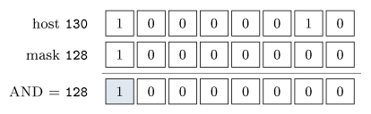

# The network layer {#sec-09-network}

Chapter 8 rested on an assumption it never justified: That a packet can
travel from your machine to any other machine on Earth. Making that true
is the network layer's job — carrying packets across many networks,
router by router, using IP addresses. Its core idea: *The network layer
moves packets between hosts across networks, choosing a path one router
at a time.* By the end of this chapter you can read an IP address like a
native, compute which network a host belongs to, explain how your laptop
got its address in the first place, and account for the small miracle
that your whole household hides behind a single public address.

## Routing packets, hop by hop {#sec-09-routing}

What distinguishes this layer from the ones above? Transport ran only on
the end machines; the network layer runs in *every router* along the way.
It moves packets host to host, possibly across many separate networks,
and its main protocols are IPv4, IPv6 and the helper ICMP. Every router
does two conceptually different jobs, and separating them is half the
understanding:

::: {#def-forwarding}
## Forwarding and routing
**Forwarding** is the fast, local action: Move an arriving packet to the
right outgoing link (the *data plane*) — it happens per packet, in
nanoseconds. **Routing** is the slower, network-wide task: Work out
*which* paths the forwarding tables should hold (the *control plane*) —
it runs in the background, keeping the tables correct.
:::

{#fig-hops}

The internet is a *datagram* network: No call is set up first; each
packet is routed independently, based on its destination address, and
routing is dynamic — if a link fails, later packets simply take another
way. (Peek at your own machine's table with `route print` or
`netstat -r`.) No single router knows the whole path; each knows only the
*next hop* towards the destination — and that is enough. The choice is
made against a small *forwarding table*: Rows pair a destination network
with an outgoing link or neighbour, the router picks the *most specific*
matching row, and a final row `0.0.0.0/0` — the default — catches
everything not listed. Your home router has exactly one of those,
pointing at your ISP.

Who fills the tables? Routing algorithms, in two classic families:
*Link-state*, where every router learns the whole map and computes
shortest paths itself (Dijkstra), and *distance-vector*, where each
router knows only its neighbours' distances and estimates improve as
neighbours share updates. Both converge on shortest paths; they differ in
how much each router must know. Across the whole internet, though, no
single computation runs: The net is divided into *autonomous systems*
(AS), each running its own internal routing, while **BGP** — the Border
Gateway Protocol — exchanges reachability *between* them, shaped as much
by business relationships as by distance. Routing is thus two-level:
Within an AS, fast and technical; between ASes, policy.

Two more facts complete the layer's character. First, routers can fall
behind: Each outgoing link has a buffer — a queue — of waiting packets;
if packets arrive faster than the link drains, the queue grows, and when
the buffer is full, further packets are *dropped*. This is precisely the
loss TCP detects and reacts to (Chapter 8); the network layer itself
makes no promise to deliver. Second, the packet's own header: An IPv4
datagram carries version, header length, a **TTL**, a protocol field,
checksum, and the source and destination IP addresses, followed by the
transport segment as data. The TTL (time-to-live) drops by one at each
router and the packet is discarded at zero — a safeguard against loops,
and, as @sec-09-diag shows, the trick behind `traceroute`. And because
different links accept different maximum packet sizes (each link has an
*MTU*, its largest frame), a datagram too big for the next link is
*fragmented* into pieces that the receiving host reassembles — costly
enough that senders usually discover the smallest MTU on the path and
stay under it.

::: {.callout-note title="Excursus — How fragmentation actually works — and why it is avoided"}
The mechanics are worth one close look. Every IPv4 datagram carries an
*identification* number; when a router must fragment, every fragment
keeps that same number, plus a *fragment offset* saying where its bytes
sit in the original, plus a flag announcing whether more fragments
follow. Two consequences fall out of this design. First, fragments are
reassembled *only at the final destination*, never by routers along the
way — each fragment is routed independently, possibly along different
paths, so no router in the middle can be sure of seeing them all. Second,
the design is fragile by arithmetic: Lose *any one* fragment and the
destination can never rebuild the datagram, so the *whole* datagram is
lost and — if TCP is above — retransmitted in full. One lost fragment
costs the entire packet. That is why senders prefer to discover the
smallest MTU on the path and stay under it, and why a datagram can even
be marked "don't fragment": Better an honest ICMP error than a silent,
expensive gamble.

*(Dostálek & Kabelová, 2006, ch. 5)*
:::

## IP addresses {#sec-09-ip}

::: {#def-ipv4}
## IPv4 address
An IPv4 address is a **32-bit** number identifying one host or router
*interface* (adapter), written in dotted decimal as four bytes of 0–255:
`10.11.1.21` is $00001010\;00001011\;00000001\;00010101$. A machine with
several adapters has several addresses.
:::

Run `ipconfig` (Windows) or `ifconfig` (macOS/Linux) and read your own.
Note the Chapter 2 payoff: An octet stops at 255 because it is one byte —
and the whole space holds $2^{32} \approx 4.3$ billion addresses, a
number Chapter 2's table already flagged as "the IPv4 address space".

Historically the space was carved into fixed *classes*: A, B and C for
ordinary hosts (differing in how many bits were network part), D for
multicast, E reserved — plus `127.*` as loopback, a host talking to
itself. Fixed classes wasted huge ranges, which is why CIDR (@sec-09-cidr)
replaced them. Some ranges were also set aside never to appear on the
public internet: *Private* addresses such as `10.*` and `192.168.*` are
used inside a LAN only and are not routable — routers drop them — which
is why your laptop and your neighbour's can both be `192.168.0.10`: Each
is purely local, and NAT (@sec-09-nat) is what lets them reach the world.
Delivery itself comes in three flavours: *Unicast*, one sender to one
receiver — the normal case; *broadcast*, one sender to every host on the
local network; *multicast*, one sender to a subscribed group (the class-D
addresses) — ideal for live streams, where the network duplicates as
needed.

Even with private ranges and NAT, 32 bits ran out. **IPv6** answers with
128 bits — $2^{128}$, an effectively unlimited supply — written as eight
groups of hex digits, with runs of zero groups abbreviated by `::` — so
`2001:db8::1` is short for `2001:0db8:0000:…:0001`; it also simplifies
the header and removes the need for NAT. The transition is gradual
coexistence, not a switch-over: IPv4 and IPv6 run side by side, and most
devices speak both.

## Subnets and CIDR {#sec-09-cidr}

Addresses are not random; they are grouped into networks, and the
grouping is pure Chapter-2 bit arithmetic.

::: {#def-cidr}
## Netmask, CIDR
A **netmask** splits an address into a network prefix and a host part: It
is a bit-mask of 1s over the prefix and 0s over the host bits, and
*address AND netmask = the network the host belongs to*. Two hosts can
talk directly only if they share a network; otherwise the packet goes to
a router. **CIDR** (Classless Inter-Domain Routing) lets the prefix be
*any* length, written `address/`$n$ — a bigger $n$ means more prefix
bits, fewer host bits, a smaller network.
:::

::: {#exm-cidr}
## Which network?
Host `10.21.26.184` with mask `255.255.252.0` (a /22). Only the third
octet is interesting — the mask is 252 there. Host third octet:
$26 = 0001\,1010$. Mask: $252 = 1111\,1100$. AND them:
$0001\,1000 = 24$. The host therefore belongs to network `10.21.24.0/22`
— and every address from `10.21.24.0` to `10.21.27.255` is on that same
network. The AND operation is Chapter 2's masking, doing real work.
:::

{#fig-cidr}

The prefix length also fixes how big a network is: With a /$n$ prefix,
$32-n$ bits remain for hosts, giving $2^{32-n}$ addresses — minus two,
for the network and broadcast addresses. A /24 has $2^8 = 256$ addresses
and thus 254 usable hosts; a /16 is a big network, a /30 a tiny one,
handy for point-to-point links. (In @exm-cidr: $32-22 = 10$ host bits, so
1024 addresses, 1022 usable.)

::: {.callout-tip title="Worked exercise 9.1 — Which network, how many hosts"}
Host `172.16.5.130` has the mask `255.255.255.128` (a /25). Which network
does it belong to, what address range does that network span, and how
many usable hosts does it hold? Work as in @exm-cidr — only the fourth
octet is interesting.

**Solution.** Fourth octet AND mask octet, bit by bit:

{fig-align="center"}

Network: `172.16.5.128/25`, spanning `172.16.5.128`–`.255`. Host bits:
$32-25 = 7 \Rightarrow 2^7 = 128$ addresses, 126 usable (network and
broadcast subtracted). Only the mask's single 1-bit survives the AND —
everything under the mask's zeros is host part.
:::

## Getting an address, and reading the network {#sec-09-diag}

In practice you do not type addresses by hand — a server hands you one. A
**DHCP** server holds a pool of addresses and *leases* one to your
machine dynamically when you join, the machine identifying itself by its
MAC address in the first request (Chapter 10's hardware address, making
an early appearance). The lease is arranged in a four-step exchange with
a friendly acronym, *DORA*: The client **D**iscovers (broadcast — it has
no address yet, so it must shout to the whole local network), the server
**O**ffers an address, the client **R**equests it, the server
**A**cknowledges. Usefully, DHCP delivers more than the address:
Typically also the gateway (your router) and a DNS server — everything
needed to start using the network.

Diagnosis is the province of **ICMP**, a helper protocol used by hosts,
routers and gateways to report problems: It carries error messages and
echo request/reply, riding inside IP datagrams while belonging to the
network layer — it is how the network talks about itself. The types to
know: 8/0, echo request and reply; 3, destination unreachable; 11, time
exceeded (TTL reached zero). Type 8 is the basis of `ping`: Send an echo,
await the reply, confirm reachability and measure the round-trip time —
remembering that no reply does not always mean "down", since some hosts
and firewalls ignore pings.

::: {#exm-traceroute}
## How traceroute really works
Type 11 enables something cleverer. `traceroute` reveals every router on
a path by letting packets expire *on purpose*: Send a packet with
TTL = 1 — the first router decrements it to zero, drops it, and returns
an ICMP "time exceeded", revealing itself; send TTL = 2 and the second
router reports back; and so on, one hop per step, until the destination
itself replies. The path you watched in Chapter 6 was built from exactly
these deliberately-expiring packets — the TTL field, a loop safeguard by
design, repurposed as a measuring tape.
:::

One look ahead before the last section: IP picks the next hop, but the
link below needs a *hardware* address. Each interface also carries a
fixed MAC address, and to send to a neighbour a host maps IP to MAC using
ARP — asking the local network "who has this IP? tell me your MAC." That
hand-off across one physical hop is Chapter 10, in full.

## NAT: One address for a whole network {#sec-09-nat}

From the internet's point of view, your whole home is a single address.
Devices inside use private addresses (say `10.0.0.*`); the router holds
one public address from the ISP and *rewrites* packets — outgoing, it
swaps the private source for its public one; incoming, it swaps back.
Network Address Translation lets many devices share one public address,
and it is a big reason IPv4 has lasted so long past its exhaustion.

If everyone leaves the house wearing the same public address, how do
replies find their way back? Through a *translation table* keyed by
ports: Inside `10.0.0.1:3345` might map to public port 5001, inside
`10.0.0.2:3345` — same private port, different device — to public port
5002; replies to each public port are rewritten back to the right inside
socket. (Ports, once again, doing addressing work — @def-port stretched
one layer down.) The hiding cuts both ways: Many devices on one address,
renumber-free ISP changes, and inside devices not directly reachable — a
rough security benefit — but also the well-known *traversal problem*: An
outside client cannot reach an inside server by its private address,
worked around with port forwarding, UPnP, or a relay in the middle,
Skype-style. Curious what the world sees? Any "what is my IP" service
shows the public address your NAT presents.

**Before Lecture 10 (The link layer).** Read the Module 10 chapter in the
textbook (`Readings.xlsx` for the pages). Try this: Run
`ipconfig`/`ifconfig` and find your IP address, netmask and gateway —
then compute, by @exm-cidr's method, which network you are on. And think
about the gap this chapter left open: IP gets a packet to the next router
— but how is it physically handed across that one link, and how is the
right neighbour found?

## Summary {#sec-09-summary}

The network layer routes packets host to host: Forwarding is the
per-packet reflex, routing the background planning (@def-forwarding); the
internet is a datagram network where each router knows only the next hop,
chosen by most-specific match in a forwarding table filled by link-state
or distance-vector algorithms inside an AS and by policy-driven BGP
between them — and where full queues drop packets, the loss TCP feels.
IPv4 addresses are 32 bits in dotted decimal (@def-ipv4), with private
and reserved ranges, three delivery modes, and IPv6's 128 bits ending the
shortage. A netmask ANDs an address into its network (@def-cidr,
@exm-cidr), CIDR makes the split flexible, and $2^{32-n}$ counts the
hosts. DHCP leases addresses through DORA; ICMP diagnoses — echo behind
`ping`, expiring TTLs behind `traceroute` (@exm-traceroute). And NAT
shares one public address through a port-keyed table, hiding the inside
for better and worse. One gap remains — the single physical hop — and it
is next week's whole subject.

## Self-check {#sec-09-self-check .unnumbered}

::: {#exr-09-forwarding}
## Forwarding versus routing
Forwarding versus routing: One sentence each, naming the plane, the
timescale, and where each runs.
:::

::: {#exr-09-subnet}
## Subnet computation
Which network does host `192.168.13.77` with mask `255.255.255.192`
(/26) belong to, and how many usable hosts does that network hold?
:::

::: {#exr-09-dhcp}
## The DHCP handshake
Name the four DHCP steps in order, and explain why the first one must be
a broadcast.
:::

::: {#exr-09-traceroute}
## How traceroute works
Explain, in terms of one specific IP header field and one specific ICMP
type, how `traceroute` discovers the third router on a path.
:::

::: {#exr-09-nat}
## NAT port translation
Two laptops behind the same NAT both open connections from their private
port 4000. How does the router keep the replies apart?
:::

::: {.callout-note collapse="true"}
## Sketch answers
(1) Forwarding: Data plane, nanoseconds per packet, in every router —
move the packet to the right outgoing link. Routing: Control plane,
background timescale, network-wide — compute which paths the tables
should hold. (2) Fourth octet $77 = 0100\,1101$, mask $192 = 1100\,0000$;
AND $= 0100\,0000 = 64$, so network `192.168.13.64/26`; host bits
$32-26 = 6 \Rightarrow 2^6 = 64$ addresses, 62 usable. (3) Discover,
Offer, Request, Acknowledge; the client has no IP address yet, so it
cannot address anyone directly and must broadcast to the whole local
network. (4) It sends a packet with the TTL field set to 3; the third
router decrements it to zero, discards the packet, and returns ICMP
type 11 "time exceeded" — revealing its own address. (5) Its translation
table maps each inside socket to a *different* public port (e.g.
4000→5001 and 4000→5002); replies arriving at each public port are
rewritten back to the matching private address and port.
:::

::: {.bridge}
Packets now cross the world: Addressed by IP, routed hop by hop, helped
along by DHCP, ICMP and NAT. One gap remains, left open deliberately:
Each hop is one physical link, and crossing it — finding the right
neighbour and handing the frame over — is a job of its own. Chapter 10
closes the stack with exactly that: MAC addresses, ARP, Ethernet and
Wi-Fi.
:::
