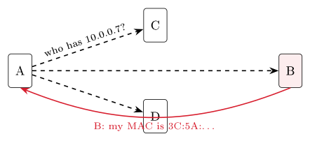
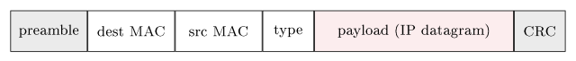
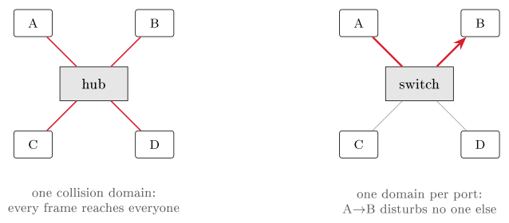
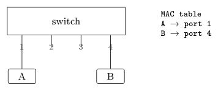

# The link layer {#sec-10-link}

Chapter 9 left one gap open on purpose: IP gets a packet to the next
router — but each hop is one physical link, and crossing it, including
finding the right neighbour on it, is a job of its own. That job is the
link layer: Moving a *frame* across a single link, between directly
connected nodes. Its core idea completes the stack: *The network layer
plans the whole route; the link layer carries the frame across each
single hop along it.* With this chapter, the descent that began at the
application layer reaches the wire — and the course's networking story
closes with one complete journey, keypress to rendered page.

## One hop: Nodes, links, frames {#sec-10-one-hop}

The vocabulary first. *Nodes* are hosts, routers and switches; *links*
are the channels connecting neighbouring nodes; and the link layer moves
a *frame* over one link, node to node. Where the network layer sees the
whole path A–B–C, the link layer only ever handles one hop, like A–B —
and each hop along a route may use a completely different technology. The
lecture's analogy travels well: A trip from Halden to Trondheim by train,
then plane, then bus — each leg its own vehicle — just as one network
path may run Ethernet, then fibre, then Wi-Fi, the IP packet riding
inside whatever frame each link uses.

Whatever the technology, the layer offers the same handful of services,
each in some form: *Framing* (wrap the datagram in a header and trailer),
*link access* (decide who may use a shared medium — @sec-10-sharing),
*reliable delivery* between neighbours (often skipped on low-error
links), *flow control* (do not outrun the neighbour), *error detection*
(spot corrupted bits) and sometimes *error correction* (fix a few without
resending). The mix is technology-dependent: On a clean fibre link
reliability is barely needed; on noisy Wi-Fi it matters greatly. And
almost all of it runs in one specific piece of hardware — the network
adapter, or NIC, which builds and reads frames, checks for errors and
controls medium access, largely independent of the CPU. The frame itself
is simple: A *header* carrying the link addresses and a type, the IP
datagram as *payload*, and a *trailer* carrying an error check.

## Link addresses and ARP {#sec-10-arp}

The header's addresses are not IP addresses.

::: {#def-mac}
## MAC address
A **MAC address** is a 48-bit hardware address — twelve hex digits —
baked into each network adapter, naming *this adapter on the local link*.
The IEEE assigns each manufacturer a prefix (the OUI); the maker fills in
the rest, so every adapter worldwide is unique. See yours with
`ipconfig /all` ("physical address").
:::

{#fig-macanatomy}

Why a second address system, when we already have IP? Because the two
work at different scales, and the contrast is exam material: The IP
address lives at the network layer, has end-to-end scope across the
internet, and is *hierarchical* — network part plus host part, like a
postal address that encodes where in the world you are. The MAC address
lives at the link layer, has scope of *one local link only*, and is
*flat* — no location meaning at all, like a person's ID number. The
consequence to remember: A packet keeps its IP addresses end-to-end but
gets a *new MAC pair on every hop*.

So a sender knowing only a neighbour's IP must first find the matching
MAC — Chapter 9's look-ahead, now in full.

::: {#def-arp}
## ARP
The Address Resolution Protocol maps a neighbour's IP address to its MAC
address. Every node keeps an *ARP cache* of known IP→MAC mappings;
entries time out so the cache stays current. ARP only ever works within
one link — it finds local neighbours, never distant hosts.
:::

::: {#exm-arp}
## ARP in action
Host A wants to send to neighbour B but knows only B's IP. A *broadcasts*
to everyone on the link: "who has IP so-and-so? Tell me your MAC." Every
node hears it; only B, who owns that IP, replies with its hardware
address. A caches the answer and sends the frame. Run `arp -a` and you
are looking at your own machine's cache of exactly these learned answers.
:::

{#fig-arp}

What does the cache actually look like? Exactly what the theory predicts.
On a Windows machine, `arp -a` prints it:

```default
C:\> arp -a

Interface: 10.0.0.5 --- 0x8
  Internet Address      Physical Address      Type
  10.0.0.1              a0-11-75-2c-00-1b     dynamic
  10.0.0.23             3c-5a-b4-1f-9e-02     dynamic
  10.0.0.255            ff-ff-ff-ff-ff-ff     static
```

Read it line by line with the chapter's vocabulary. `10.0.0.1` is the
gateway — the router, learned by an ARP exchange like @exm-arp and marked
*dynamic*: It was answered, cached, and will time out. `10.0.0.23` is a
neighbour this machine recently talked to — and its first three bytes,
`3c-5a-b4`, are the OUI of @fig-macanatomy. The last line is no mystery
either: `ff-ff-ff-ff-ff-ff` is the *broadcast* MAC — all 48 bits set —
the "everyone on this link" address that ARP's own question is sent to;
it is *static* because it never needs to be learned. The cache, in short,
is the protocol's memory: Every entry is a question that did not have to
be asked twice.

::: {.callout-note title="Excursus — ARP's odd relatives"}
The protocol has two variants that answer questions nobody appears to
have asked. In *proxy ARP*, a router answers an ARP request *on behalf
of* a host on another network: It replies with its *own* MAC address,
quietly collects the frames, and forwards them onward — the sender
believes the destination is a local neighbour and never learns otherwise.
Once a common way to join networks without configuring routes, it
survives today in corners of Wi-Fi and virtualisation setups. In
*gratuitous ARP*, a host broadcasts an ARP request for *its own* IP
address at start-up. Useful twice over: If anyone answers, the address is
already taken — duplicate-IP detection for free — and if nobody does,
every listening neighbour has just refreshed its cache with the
newcomer's mapping, which is exactly how a machine with a freshly changed
network card announces itself. Both tricks work because ARP trusts
whatever it hears on the link — a generosity that security people, who
know it as the basis of ARP spoofing, regard with less affection.

*(Dostálek & Kabelová, 2006, ch. 5)*
:::

## Sharing the medium {#sec-10-sharing}

ARP's broadcast worked only because the link is *shared* — which raises
the layer's classic problem. On a point-to-point link (one sender, one
receiver) there is no contest; on a *broadcast* medium — classic Ethernet
on one wire, Wi-Fi in the air — many nodes share one channel, and two
simultaneous transmissions *collide*: Their signals overlap and both are
lost. The link layer needs an access rule, and the rules fall into three
families.

*Channel partitioning* gives each node a fixed slice so collisions never
happen: TDMA divides time into slots, FDMA divides the spectrum into
bands, CDMA separates senders by code. Excellent for steady traffic
(cellular voice); wasteful for bursty traffic, since a silent node still
holds its slice. *Taking turns* lets exactly one node send at a time: A
circulating token (Token Ring) or a polling controller — orderly and
collision-free by design, but the coordination adds delay and a single
point of failure. *Random access* embraces the risk:

::: {#def-csmacd}
## CSMA/CD
Carrier Sense Multiple Access with Collision Detection: (1) *carrier
sense* — listen; if the medium is busy, wait; (2) send when it is free;
(3) *collision detect* — if signals clash, stop at once; (4) wait a
*random* back-off time, then try again. The random back-off makes a
repeat collision unlikely. This is exactly how classic Ethernet shared a
wire.
:::

Internet traffic is bursty (Chapter 6 made the point for packet
switching; it returns here), which is why random access usually won.
Sharing has a cost either way: A shared medium splits its capacity among
all active users — one node alone gets the full rate; many nodes each get
a fraction, with collisions wasting time on top. That is why a crowded
café Wi-Fi feels slow even with a fast line behind it: The access point's
capacity is divided among every connected device.

## Ethernet and switches {#sec-10-ethernet}

The most successful wired design tamed the sharing problem so thoroughly
it took over the LAN. **Ethernet** (IEEE 802.3) was the first widely-used
LAN technology and remains the wired standard; its character is
minimalist — *connectionless* (no handshake before a frame) and
*unreliable* (no acknowledgements; recovery is left to TCP far above) —
and it originally shared one wire with CSMA/CD. It kept pace for decades:
From 10 Mbit/s shared coax through Fast Ethernet to today's switched
gigabit and beyond, while its frame stayed remarkably stable: Preamble,
destination MAC, source MAC, a *type* field naming the protocol inside
(usually IP), the payload, and a CRC trailer that lets the receiver
detect a corrupted frame and drop it.

{#fig-frame}

What modernised Ethernet was a box. Early installations joined machines
through a *hub* — a physical-layer repeater that blindly copies every bit
to all ports, making the whole network one big collision domain. The
*switch* replaced it: A link-layer device that reads each frame's
destination MAC and forwards it *only* to the right port, so each port
becomes its own collision domain and everyone can send at once. Best of
all, a switch configures itself:

{#fig-hubswitch}

::: {#exm-switch}
## Switch self-learning
A switch keeps a table of MAC → port entries with timestamps — and fills
it just by watching. When a frame arrives, the switch learns that the
*sender's* MAC lives on that port. Destination unknown? It floods the
frame out of all ports, then learns from the reply. No configuration
needed: Plug and play, the network learned as frames flow.
:::

::: {.callout-tip title="Worked exercise 10.1 — Think like a switch"}
A freshly powered switch has an empty table. Then: (1) host A on port 1
sends a frame to host B; (2) B, on port 4, replies to A; (3) A sends to B
again. For each step: What does the switch *learn*, and out of which
port(s) does the frame go?

{fig-align="center"}

**Solution.** (1) Learns A → port 1 from the source address; destination
B unknown $\Rightarrow$ floods out of all ports except 1. (2) Learns
B → port 4; destination A is in the table $\Rightarrow$ forwards to
port 1 only. (3) Nothing new to learn; B is known $\Rightarrow$ forwards
to port 4 only. After one round trip the flooding stops — the table shown
above has built itself.
:::

Scaled up, this is how an institution's network is built: Switches knit
the internal LAN together by MAC, and a single router connects the whole
subnet to the rest of the internet by IP. The three boxes are best kept
apart by layer — all of them store and forward, at different levels: A
hub works at the physical layer, reads nothing, isolates nothing; a
switch works at the link layer, reads MAC addresses, isolates traffic,
and is plug-and-play; a router works at the network layer, reads IP
addresses, isolates traffic, and needs configuration. Switch = within a
LAN by MAC; router = between networks by IP.

## Wireless — and the whole journey {#sec-10-wireless}

Wired LANs solved sharing with switches; wireless cannot, because there
is no wire to switch — so Wi-Fi shares the air, carefully. **Wi-Fi**
(IEEE 802.11) is a family of standards — a/b/g/n/ac/ax…, with Wi-Fi 6
(802.11ax) and Wi-Fi 7 (802.11be) the newest — operating either through
an access point (AP) or ad-hoc, device to device. All devices on an AP
share its capacity: The cost-of-sharing paragraph, made wireless.

One physical fact forces a different access rule: A radio cannot listen
while transmitting, so it cannot reliably *detect* its own collisions.
Wi-Fi therefore uses **CSMA/CA** — collision *avoidance*: Sense the
medium, wait a random back-off, then send — trading Ethernet's simple
detect-and-retry for careful avoidance. Radio adds further quirks no
cable has: Signal strength falls off rapidly with distance; walls and
obstacles attenuate (frequency-dependently); reflections and other
devices interfere — which is why Wi-Fi range and speed vary so much
around a building, and why wired links stay the dependable choice. Wi-Fi
has siblings tuned to other jobs: Bluetooth for a few metres (earbuds,
peripherals), NFC for a few centimetres (tap-to-pay), Zigbee for
low-power smart-home sensors, cellular 4G/5G for the wide area — all
facing the same shared-air challenge with different range-power-speed
trades.

An open medium also raises the security question directly: Radio travels
through walls, so a neighbour or passer-by can pick up the signal. Modern
Wi-Fi therefore encrypts the link with **WPA2 or WPA3**, so only devices
knowing the password can read the traffic; an open, password-free network
leaves everything readable — avoid sending anything sensitive over one.
And remember the layering: HTTPS (Chapter 7) still protects each web page
*on top of* the Wi-Fi encryption — two locks, different layers.

One shared service runs across every link technology: Catching corrupted
bits. In increasing strength: A *parity bit* — one extra bit, catching
any single flip, simple but weak; a *checksum* — a sum over the data, as
UDP and TCP use (Chapter 8); and the *CRC* — a polynomial code in the
Ethernet trailer that catches almost all real-world errors. This is the
family Chapter 4's ECC memory promised would "return in networking" — and
the division of labour is tidy: Link-layer detection drops bad frames
early; reliable delivery, where needed, is rebuilt by TCP far above.

::: {#exm-endtoend}
## One web request, end to end
Every layer of the last five chapters, in a single action. (1) DNS
resolves the name to an IP address (Chapter 7). (2) TCP opens a
connection to the server (Chapter 8). (3) IP chooses the route, hop by
hop (Chapter 9). (4) ARP finds the next hop's MAC, and the frame crosses
the link (this chapter). (5) HTTP carries the page back, and the browser
renders it (Chapter 7) — all of it, from the first keypress to the last
pixel, as bits under conventions (Chapter 1). Application down to link
and back: The whole networking module in one page load.
:::

**Before Lecture 11 (Repetition).** Skim your notes from Lectures 1–10
and mark anything still unclear — next week's session is built for
exactly those marks. Try this: Run `arp -a` to see your machine's ARP
cache, and find your own MAC with `ipconfig /all`.

## Summary {#sec-10-summary}

The link layer carries a frame across one hop, between directly connected
nodes, in the adapter: Framing, access, error detection — the service mix
varying with the medium. MAC addresses (@def-mac) are flat, 48-bit and
local, where IP is hierarchical and end-to-end — so the IP addresses
persist across a journey while the MAC pair changes at every hop, and ARP
(@def-arp, @exm-arp) bridges the two by broadcast-and-reply on the local
link. A shared medium needs an access rule — partitioning, taking turns,
or random access, with CSMA/CD (@def-csmacd) the classic and bursty
traffic its justification — and sharing always divides capacity. Ethernet
plus self-learning switches (@exm-switch) dominate wired LANs, isolating
collision domains port by port, with hub, switch and router cleanly
separated by layer. Wi-Fi shares the air with CSMA/CA — it avoids
collisions because it cannot detect them — secured by WPA2/WPA3; and
parity, checksums and CRCs catch corrupted bits at every link, while TCP
rebuilds reliability above. The stack is complete (@exm-endtoend); the
two remaining chapters consolidate it.

## Self-check {#sec-10-self-check .unnumbered}

::: {#exr-10-addresses}
## Addresses along a path
A packet crosses four links from your laptop to a server. How many times
do its IP addresses change, and how many times its MAC addresses? Why?
:::

::: {#exr-10-arp}
## The ARP exchange
Describe the ARP exchange when host A first contacts neighbour B — who
hears what, who answers, and what does A store?
:::

::: {#exr-10-csma}
## CSMA/CA versus CSMA/CD
Why does Wi-Fi use CSMA/CA rather than Ethernet's CSMA/CD? Name the
physical constraint.
:::

::: {#exr-10-boxes}
## Hub, switch, router
Hub, switch, router: Give each device's layer and what it reads — and say
which of the three isolates collision domains.
:::

::: {#exr-10-crc}
## Reliability and the CRC
Ethernet is "unreliable" by design. Where in the stack is reliability
provided instead, and what does the Ethernet CRC contribute?
:::

::: {.callout-note collapse="true"}
## Sketch answers
(1) The IP source and destination never change — zero times; the MAC pair
changes on every hop — four times — because MAC addresses have only
local, per-link scope. (2) A broadcasts "who has this IP?" to the whole
link; every node hears it, but only B — the owner of the IP — replies
with its MAC; A caches the IP→MAC mapping (with a timeout) and sends the
frame. (3) A radio cannot listen while it transmits, so it cannot detect
its own collisions; it must therefore *avoid* them — sense, random
back-off, then send. (4) Hub: Physical layer, reads nothing; switch: Link
layer, reads MAC addresses; router: Network layer, reads IP addresses.
The switch isolates collision domains — each port becomes its own.
(5) Reliability lives in TCP at the transport layer (ACKs and
retransmission); the CRC only *detects* a corrupted frame so it can be
dropped early — detection below, recovery above.
:::

::: {.bridge}
The stack is complete: From a keypress through DNS, TCP, IP and ARP to a
rendered page, every layer accounted for. What remains is to make it
stick. Chapter 11 walks back through the whole course in five blocks,
with quick checks in the exam's own format — the place to find the gaps
while there is still time to close them.
:::
