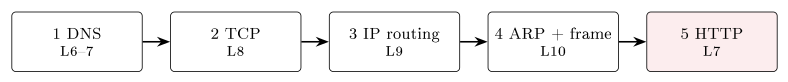

# Repetition {#sec-11-repetition}

The content of the course is complete; this chapter and the next
consolidate it. Lecture 11 revisits the key points of Modules 1–10 — the
big ideas, not every detail — interleaved with quick-check questions in
exactly the exam's style: Four options, one correct. Use this chapter as
a *revision map*: Read a block, try its quick check, and wherever
something feels fuzzy, go back to that chapter — the point of a round-up
is to find the gaps while there is still time to close them. The goal for
the week, in the lecture's own words: Leave able to trace one click from
keypress to rendered page, naming every layer on the way. The course
falls into five blocks for review.

## Block 1: Data and numbers {#sec-11-block1}

Every positional system has a base and digits with place value: Decimal
(base 10), binary (base 2), octal (base 8), hexadecimal (base 16, digits
0–9 and A–F). Computers store everything in binary; hex is the compact
human notation for groups of four bits (Chapter 2). The core skill is
moving between decimal and binary with the place values
128–64–32–16–8–4–2–1: Binary $0001\,1010 = 16+8+2 = 26$; decimal
$45 = 32+8+4+1 = 0010\,1101$. One byte covers 0–255 — which is exactly
why an IPv4 octet stops at 255 (Chapter 9, closing the loop). Binary
addition works like decimal with carries at two ($1+1 = 10$: Write 0,
carry 1); multiplication is shift-and-add; and negatives use two's
complement — invert all bits, add 1 — which avoids a double zero and
turns subtraction $a-b$ into the addition $a + (\text{two's complement
of } b)$, so the CPU needs only an adder (@def-twoscomp, @exm-adder). For
text: ASCII gives 7 bits and 128 characters — English only; Unicode gives
every character a code point (Å is U+00C5); UTF-8 encodes those code
points at variable length — one byte for ASCII, more for the rest — and
its backward compatibility with ASCII is why it became the web's default
(Chapter 3).

*Quick check.* What is binary 1011 in decimal? (A) 9   (B) 11   (C) 13
(D) 7. — Answer: (B), since $8+2+1 = 11$.

## Block 2: Logic and the computer {#sec-11-block2}

Gates compute the Boolean basics — AND (both), OR (at least one), XOR
(exactly one: The inputs *differ*), NOT (invert) (@def-gates). Combine
them and you can do arithmetic: The full adder takes bits $A$, $B$ and a
carry-in, produces a sum bit and a carry-out, and chained adders add
whole binary numbers — the bridge from logic to computing (@exm-adder).
Wire enough together and you have the Von Neumann machine: One memory for
code *and* data, a CPU repeating fetch–decode–execute (in full, the HIDAS
cycle of @def-hidas) one instruction at a time, and a memory hierarchy —
registers, cache, RAM, disk — trading speed for size, with hot data kept
near the CPU (Chapter 4). Raw hardware is unusable alone; the operating
system makes it a computer: Abstraction above (files, windows, the
shell), resource management below (processes and the scheduler sharing
the CPU; virtual memory; the file system), with user mode versus kernel
mode keeping one misbehaving program from taking down the machine
(Chapter 5).

*Quick check.* Which gate outputs 1 *only* when its two inputs differ?
(A) AND   (B) OR   (C) XOR   (D) NAND. — Answer: (C) — 1 for 01 and 10,
0 for 00 and 11.

## Block 3: The internet and the application layer {#sec-11-block3}

The internet joins independent networks through shared protocols
(TCP/IP); two reference models describe the stack — OSI with seven
layers, TCP/IP with five — and ours is the five: Application, transport,
network, link, physical, each serving the layer above and talking to its
peer opposite (@def-stack). Data moves down by encapsulation: Transport
adds ports and the unit is a *segment*; network adds IP addresses — a
*datagram*; link adds MACs — a *frame*; the receiver unwraps in reverse,
and the unit's name tells you the layer (@def-encapsulation). At the top,
DNS is the first step of almost every connection: A distributed hierarchy
— root, TLD, authoritative — turning `www.kristiania.no` into an address,
with answers cached under a TTL (@def-dns); HTTP fetches the web in
request/response pairs with methods, status codes and cookies; SMTP
pushes mail towards the recipient while POP3/IMAP pull it back; and the
plaintext protocols have encrypted successors — HTTPS over TLS, SFTP over
SSH — because anything unencrypted is readable on the path
(Chapters 6–7).

## Block 4: Transport and network {#sec-11-block4}

Transport connects *processes* via ports; IP plus port is a socket
(@def-port). UDP is connectionless and lean — best for live media and
DNS, where a glitch beats a stall; TCP opens a connection with the
three-way handshake and delivers a reliable, ordered byte stream through
ACKs, retransmission, flow control and congestion control (Chapter 8).
Beneath it, the network layer routes packets host to host, hop by hop, by
forwarding tables; IPv4 addresses are 32 bits, IPv6's are 128; and CIDR's
/$n$ splits every address into network and host part — host
`10.21.26.184` with mask /22: Third octet 26 AND 252 = 24, so network
`10.21.24.0/22`, with $32-22 = 10$ host bits giving 1024 addresses, 1022
usable (@exm-cidr). Three helpers make IP networks livable: DHCP hands
your machine an address (plus gateway and DNS) automatically; ICMP
carries errors and the echo behind `ping`, while its "time exceeded"
powers `traceroute`; and NAT lets a whole home share one public address
through a port-based translation table — a big reason IPv4 lasted so long
(Chapter 9).

*Quick check.* Which transport protocol is *connectionless* and best for
live video? (A) TCP   (B) UDP   (C) IP   (D) ARP. — Answer: (B) — no
handshake, tolerates loss; a glitch beats a stall.

## Block 5: The link layer, and the whole journey {#sec-11-block5}

The link layer runs in the adapter and carries a frame across one hop,
wrapped with a CRC check. MAC addresses are flat, 48-bit and per-adapter
— local scope only — so IP stays end-to-end while the MAC changes on
every hop; ARP maps a neighbour's IP to its MAC by broadcast-and-reply
(@def-mac and @def-arp). Sharing a medium needs an access rule: Wired
Ethernet historically detected collisions (CSMA/CD) and now avoids them
structurally with self-learning *switches* that isolate each port; Wi-Fi
must *avoid* collisions (CSMA/CA), since a radio cannot detect its own.
Keep the boxes straight: A switch forwards within a LAN by MAC; a router
forwards between networks by IP (Chapter 10). And the whole course
compresses into one action: You type a URL and DNS finds the server's IP
(Chapters 6–7); TCP opens a reliable connection (Chapter 8); IP routes
the packets hop by hop (Chapter 9); ARP and the link layer carry each
frame across each hop (Chapter 10); HTTP returns the page and the browser
renders it — all of it as bits under conventions (Chapters 1–3). If you
can narrate that trace unaided, you are ready.

{#fig-journey}

*Quick check.* ARP is used to find a node's ＿＿ when you know its ＿＿.
(A) IP / MAC   (B) MAC / IP   (C) port / IP   (D) name / IP. — Answer:
(B) — ARP maps a known IP to the matching hardware MAC.

## The big picture — and one closing note {#sec-11-big-picture}

If you remember five things from the semester, the lecture nominates
these: Everything is bits — numbers, text, logic, all binary; gates build
computers, and the OS makes them usable; the internet is layered —
protocols, encapsulation, OSI and TCP/IP; transport and network deliver
the bytes — TCP/UDP, IP, routing, NAT; and the link layer crosses each
hop — MAC, ARP, Ethernet, Wi-Fi.

One practical security topic closes the round-up: Passwords. A password's
strength is its *entropy* in bits —
$\log_2(\text{alphabet}^{\text{length}})$ — and length adds entropy
faster than exotic symbols: A long passphrase beats a short "complex"
one. Four random words from a 2000-word list give
$\log_2(2000^4) \approx 44$ bits — far stronger than `P@ss1`. Never reuse
passwords (one leak then unlocks every other account); in practice, use a
password manager for long, unique passwords, and turn on multi-factor
authentication wherever it is offered.

**Before Lecture 12 (Exam preparation).** Go back to any topic that felt
shaky in this chapter's quick checks. Try re-doing a few worksheet
questions under time pressure. And come with questions: The final session
covers the exam's format, tools and strategy — it is delivered live and
has no chapter in this script.

## Closing words {#sec-11-closing}

That is the course. Eleven chapters ago it opened with a claim that may
then have sounded like a slogan: *Everything is bits, and only the
encoding differs*. By now you have seen the claim carry a number system,
a text standard, a processor, an operating system and the entire internet
— and you have traced one click from a keypress, through gates, cycles,
system calls, sockets, datagrams and frames, to a rendered page. Walk
into the exam with that trace in your head, answer everything, and trust
the breadth of what you have built this semester. Good luck — and
remember the monster stayed small because you fed it nothing.
